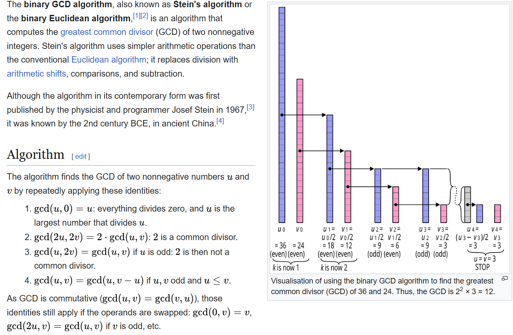
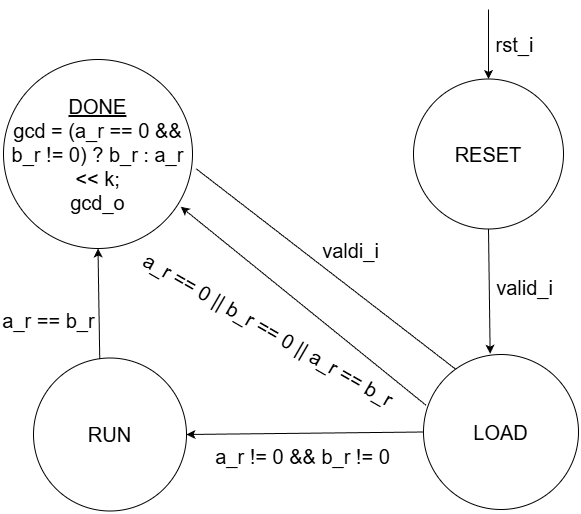
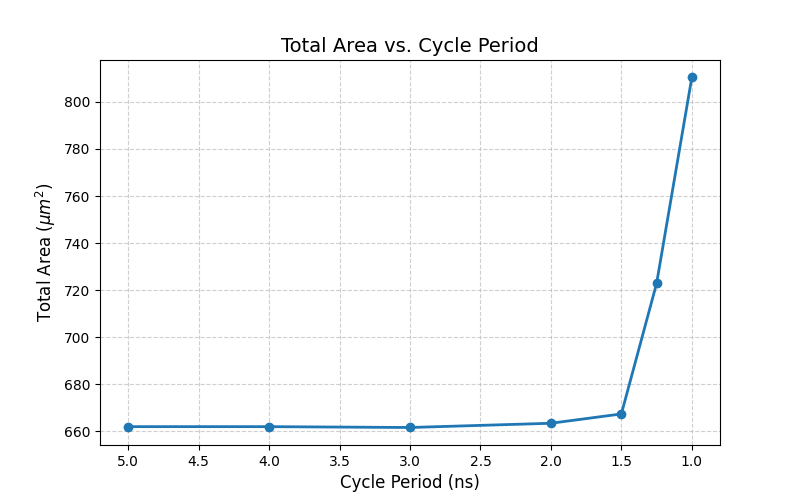
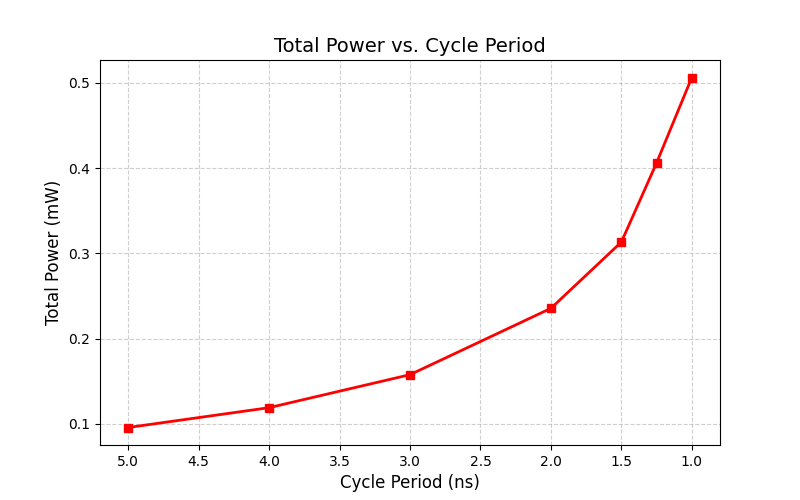
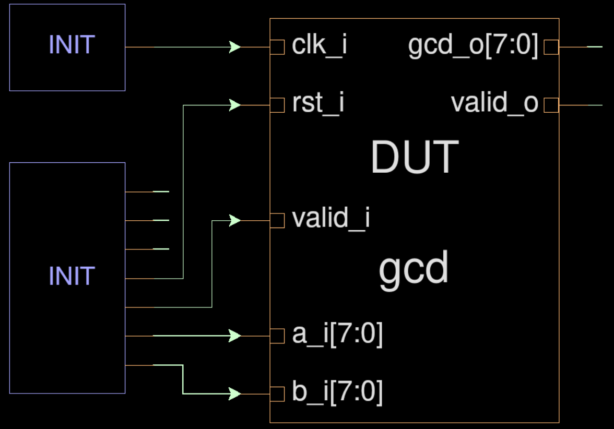
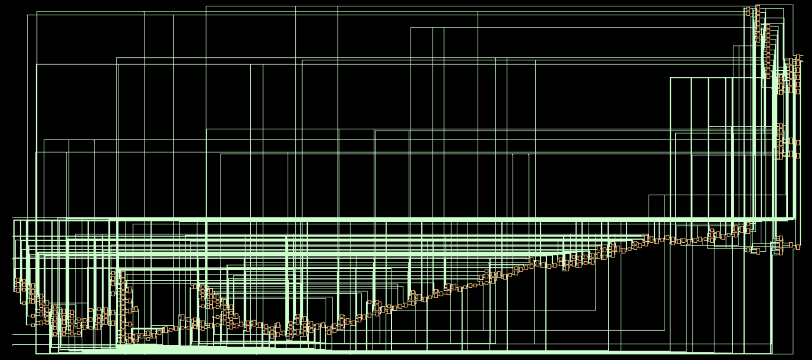
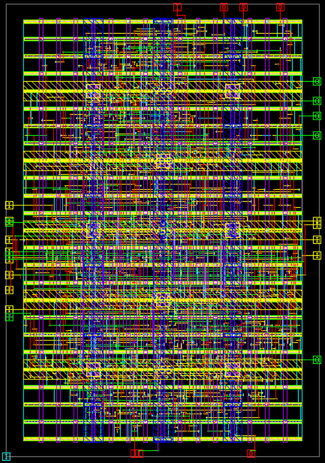

# Assignment 1 Design and pre-syn Simulation of GCD (Greatest Common Divisor)

## Design

This GCD uses the [binary GCD algorithm](https://en.wikipedia.org/wiki/Binary_GCD_algorithm)



### Finite State Machine

This controller is written in Moore FSM



## Simulation

Before simulating, setup the environment
```bash
mkdir -p sim/ && mkdir -p sim/behav
```

Link the Makefile
```bash
cd sim/behav && ln -s ../../src/Makefiles/Makefile_sim_presyn Makefile
```

In the `sim/behav` folder, use command to link src
```tcsh
make link_src
```

To run the simulation with the given stimuli, use command
```tcsh
make vcs
```

To run the simulation with the random stimuli, use command
```tcsh
make vcs TESTNAME=random RAND_SEED=<unsigned_integer>
```

In the file `src/verilog/tb_gcd.sv`, you can modify `TESTCASES` to change the number of random stimuli applied to DUT.

# Assignment 2 Synthesis and post-syn Simulation of GCD

## Command & Variables in tcl file / DC

### Set the clock
```tcl
set CLOCK_PERIOD 5
create_clock -name "clk" \
    -period "$CLOCK_PERIOD" \
    -waveform "0 [expr $CLOCK_PERIOD*0.5]" \
    [get_ports clk_i]
```

---

### Set the Hold Skew
```tcl
set HOLD_SKEW 0.25
set_clock_uncertainty -hold "$HOLD_SKEW" clk
```

---

### Set the Setup Skew
```tcl
set SETUP_SKEW 0.5
set_clock_uncertainty -setup "$SETUP_SKEW" clk
```

---

### Set the input delay
```tcl
set INPUT_DELAY 0.15
set_input_delay "$INPUT_DELAY" -clock clk \
    [remove_from_collection [all_inputs] [get_ports{clk_i}]]
```

---

### Set the output delay
```tcl
set OUTPUT_DELAY 0.12
set_output_delay "$OUTPUT_DELAY" -clock clk [all_inputs]
```

---

### Prioritize hold violation at all cost
```tcl
set_critical_range 0.5 $current_design
set_cost_priority {min_delay max_transition max_delay max_fanout max_capacitance}
```

---

## Synthesize

Setup the environment
```bash
mkdir -p syn/ && cd syn/
```

Link the Makefile
```bash
ln -s ../src/Makefiles/Make_syn Makefile
```

Run the synthesis
```tcsh
make design
```

## Synthsis Results with tuning parameters

### Area vs Cycle Time

| Cycle Period (ns) | Total Area (µm²) | Combinational (µm²) | Noncombinational (µm²) |
|------------------|------------------|---------------------|------------------------|
| 5.0  | 662.04 | 424.44 | 237.60 |
| 4.0  | 662.04 | 424.44 | 237.60 |
| 3.0  | 661.68 | 424.08 | 237.60 |
| 2.0  | 663.48 | 425.88 | 237.60 |
| 1.5  | 667.44 | 429.84 | 237.60 |
| 1.25 | 722.88 | 485.28 | 237.60 |
| 1.0  | 810.36 | 549.72 | 260.64 |

---

### Area vs Cycle Time Plot



---

### Power vs Cycle Time

| Cycle Period (ns) | Total Power (mW) | Internal Power (mW) | Switching Power (mW) |
|------------------|------------------|---------------------|----------------------|
| 5.0  | 0.0958 | 0.0845 | 0.00865 |
| 4.0  | 0.1191 | 0.1056 | 0.0108 |
| 3.0  | 0.1578 | 0.1407 | 0.0143 |
| 2.0  | 0.2356 | 0.2113 | 0.0216 |
| 1.5  | 0.3133 | 0.2823 | 0.0284 |
| 1.25 | 0.4062 | 0.3650 | 0.0380 |
| 1.0  | 0.5063 | 0.4486 | 0.0540 |

---

### Power vs Cycle Time Plot



---

### Observations

- For relaxed cycle periods (5 ns down to 1.5 ns), total cell area stays nearly constant (~660–670 µm²).
- At aggressive clock targets (1.25 ns and 1 ns), area increases significantly due to combinational logic growth.
- This reflects synthesis optimizations such as gate upsizing, buffer insertion, and logic restructuring.
- Total power increases with decreasing cycle period (0.096 mW → 0.506 mW).
- Internal power dominates, while switching power increases rapidly at higher frequencies.

### Check Reports & Results


### Best Clock

- Best clock period: **1ns**
- Best clock frequency: **1 GHz**

---

### Units

- Time: ns
- Resistance: k $\Omega$
- Voltage: V
- Current: mA

---

### Cell Count

- Total cells: **316**

---

### Area Breakdown

- Total cell area: **810.36 $\mu m^2$**
- Combinational area: **549.73 $\mu m^2$**
- Noncombinational area: **260.64 $\mu m^2$**

---

### Worst Timing Path

- Path group: `clk`
- Startpoint: `b_r_reg[2]`
- Endpoint: `a_r_reg[2]`
- Slack: **0.00 ns**

---

### Power Report

- Total power: **0.5063 mW**
- Internal power: **0.4486 mW**

---


### Runtime

- Compile time: **30.43 s**

---

### Block-Level Schematic





---

### Clock-to-Q Delay

- **t_cq = 0.13 ns**

---

## Run post-synthesis simulation

Before simulating, setup the environment
```bash
mkdir -p sim/ && mkdir -p sim/syn
```

Link the Makefile
```bash
cd sim/syn && ln -s ../../src/Makefile/Makefile_sim_postsyn Makefile
```

Then the just follow the same steps in assignment 1 to do post-syn simualtion

# Assignment 3 Automatic Placement and Routing and post-apr Simulation of GCD

## Command & Variables in tcl files / ICC2

### Floorplan Aspect Ratio & Utilization

Constrain the floorplan using a core aspect ratio of **3** and core utilization of **0.6**.

```tcl
set CORE_UTIL_RATIO 0.6
initialize_floorplan -control_type $FP_CTRL_TYPE \
    -shape $FP_SHAPE \
    -flip_first_row $FP_FLIP_FIRST_ROW \
    -core_utilization $CORE_UTIL_RATIO \
    -side_ratio [list 1 3] \
    -core_offset $TILE_HEIGHT
```

---

### Floorplan Dimensions (Super-Tiles)

Constrain the floorplan to **18 super-tiles high × 6 super-tiles wide**.


```tcl
set W_SUPER_TILE_NUM 6
set H_SUPER_TILE_NUM 18

set side_length_a [expr $TILE_WIDTH  * $W_SUPER_TILE_MUL * $W_SUPER_TILE_NUM]
set side_length_b [expr $TILE_HEIGHT * $H_SUPER_TILE_MUL * $H_SUPER_TILE_NUM]

initialize_floorplan -control_type $FP_CTRL_TYPE \
    -shape $FP_SHAPE \
    -flip_first_row $FP_FLIP_FIRST_ROW \
    -side_length [list $side_length_a $side_length_b] \
    -core_offset $TILE_HEIGHT
```

---

### Clock Tree Levels

```tcl
report_buffer_trees -from [get_nets clk_i]
```

- Clock tree depth: **2 Levels**

--- 

### Reset Tree Levels

```tcl
report_buffer_trees -from [get_nets rst_i]
```

- Reset buffer tree depth: **5 Levels**

---

## APR

Setup the environment
```bash
mkdir -p apr/ && cd apr/
```

Link the Makefile
```bash
ln -s ../src/Makefiles/Make_apr Makefile
```

Run the synthesis
```tcsh
make design
```

## APR Results

### Layout



---

### Area & Utilization Summary

| Metric | Value |
|------|------|
| Total cell area | 694.44 µm² |
| Total core area | 1244.16 µm² |
| Aspect ratio (W:H) | 2 : 3 |
| Utilization ratio | 0.5582 |

---

### Worst Setup Timing Path

| Path Group | Startpoint | Endpoint | Slack (ns) |
|-----------|-----------|----------|-----------|
| clk | b_r_reg[5] | b_r_reg[1] | 0.34 |

---

### Power Consumption

- Total power: **1.43e+05 nW**
- Dominant power group: **Clock network**
- Same dominant power group as synthesis power report

---

### Compliation Time

- Total APR runtime: **2 minutes 33 seconds**

--- 

### Cell Cout Breakdown

| Cell Type | Count | Percentage (%) |
|---------|------|----------------|
| Flip-Flops | 30 | 4 |
| Latches | 0 | 0 |
| Clock Gaters | 0 | 0 |
| Filler Cells | 249 | 39 |

---

### Total Wire Length

- Total routed wire length: **3633.29 µm**

---

### Post-APR Clock-to-Q Delay

- Typical **t_cq $\approx$ 0.13 ns**

---

### Setup Degradation Analysis

- Setup slack degraded after APR
- Synthesis setup slack: **1.24 ns**
- Post-APR setup slack: **0.34 ns** (at 2.5 ns clock)

Reason:
After APR, clocks become propagated (CTS insertion delay + skew), and real routing introduces RC parasitics and buffers. This increases data path delay and reduces slack.

---

### Synthesis vs APR Timing Comparison

- Same start-to-end path shows larger data delay and smaller slack in APR
- Example path: `gcd_o_reg[6]`
  - Synthesis slack: **+1.76 ns**
  - APR slack: **+0.37 ns**

Conclusion:
APR timing is more realistic and closer to silicon behavior compared to synthesis.

