# Timing Closure

### Clock Skew

$$t_{skew} = L_C - L_L$$

- $L_L$ & $L_C$: clock latency to launch / capture Flip-Flops

- We don't know the clock skew even at pre-CTS stage, only after CTS, we could know the clock skew at Post-CTS.

## Setup Requirement

$$t_{cq,max} + t_{logic,max} + t_{setup} + t_{uncertain,max} \le t_{clk} + t_{skew}$$

- Think about why we say **positive** $t_{skew}$ relax the requirement of $t_{setup}$

- **Sequencing Overhead**: $t_{cq,max} + t_{setup}$, which is related to Sequencing or Pipelining Overhead

$$t_{slack,setup} =  t_{clk} + t_{skew} - (t_{cq,max} + t_{logic,max} + t_{setup} + t_{uncertain,max})$$

- **Setup slack should be positive** otherwise it violates setup requirement

## Hold Requirement

$$t_{cq,min} + t_{logic,min} - t_{uncertain,min} \ge t_{hold} + t_{skew}$$

- Think about why we say **negative** $t_{skew}$ relax the requirement of $t_{hold}$

- Note $t_{hold}$ is irrelative to $t_{clk}$, that's why we said ***Hold Violation* is much worse than *Setup Violation*** because you cannot use the last resort: reduce frequency to solve *Hold violation*

- **Race Immunity**: $t_{cq,min} - t_{hold}$, it will grant circuit avoiding data racing.

$$t_{slack,hold} = t_{cq,min} + t_{logic,min} - t_{uncertain,min} - (t_{hold} + t_{skew})$$

- **Hold slack should be positive** otherwise it violates hold requirement

# Synthesis

Produce a netlist with each cell referenced to a design in the target library (std-cells, memory, macros*)

## Nomenclature

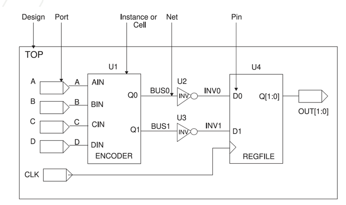

- Design: {TOP, ENCODER, REGFILE}

- Reference: {ENCODER, REGFILE, INV}

- Instance: {U1, U2, U3, U4}

## A basic overiew of Synthesis and Optimization
```
Analyze
    ↓
Elaborate
    ↓
Mapping
    ↓
Optimization (Under given environment(drive/loading) and timing constraints)
    - Archiecture Optimization
    - Logic Level
    - Gate Level
Finally generate gate-level netlist
```

**Analyze**: Parse Verilog, Perform Syntax and Semantic Analysis (type-consistency, reserved keywords etc.) write in intermediate form

**Elaborate**: Produce *techonology-independent netlist* that is functionally equivalent to your behavioral description using its internal libraries - standard, DW, GTECH

- At each level, check to see if a cell / instance can be resolved to a reference (a design) loaded into compiler memory or existing in the link library

- **after elabroating, the desin will be mapped to a GTECH library (General Technology)**

- **after mapping, the design will be mapped to gate like INV, AND, OR gates**

**Optimization**: For the given *environment (drive/loading)* and *timing constraints*

- **Architectural Optimization** (Share common sub-expressions, resources, reorder operations, identify arithmetric operators for datapath synthesis)

- **Logic Level** (Structing vs. Flatting for Area vs. Speed)

- **Gate Level** (Tech. mapping to gate type/drive for delay opt., design rule fixing, area optimization)

**Gate-level Netlist**: Produce gate-level netlist made up of digital circuits you have provided in the target library.

## Design Compiler Flow

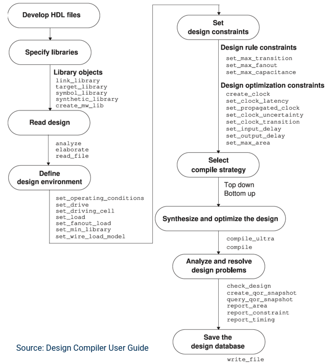

### Load Library

- link_library

- target_library

- symbol_library

- synthetic_library

- create_mw_lib

### Read Design

- analyze

- elaborate

- read_file

### Design environement

- `set_operating_conditions`: Sets (Process-Voltage-Temperature) (PVT) corner, it usually has typical, slow, or fast library

- `set_drive`: assigns a driving strength for input ports (models the upstream driver cell)

    - `set_drive 2 [get_ports A]; # Drive strength = resistance in ohms`

- `set_driving_cell`: tells DC exactly what cell type drives an input port

    - `set_driving_cell -lib_cell INV_X4 [get_ports A]`

- `set_load`: Defines load capacitance on output ports (models external circuitry).

    - `set_load 0.1 [get_ports Y]; # Load = 0.1 pF`

- `set_fanout_load`: Tells DC what capacitance one "unit fan-out" corresponds to.

- `set_min_library`: Specifies a library used for min-delay (hold time) analysis, usually the fastest corner.

- `set_wire_load_model`: Adds estimated RC parasitics for interconnect before actual P&R parasitics are available. Not used if running DC_topo (topographical mode) since DC_topo estimates wire RC from floorplan.

### Constraints Commands

**Constriants on DRC**

- `set_max_transition`: Maximum allowed input transition (rise/fall time); Prevents too-slow edges that cause timing/power issues.

    - `set_max_transition 0.5 [current_design]`

- `set_max_fanout`: Restricts how many loads a pin can drive.

    - `set_max_fanout 6 [current_design]`

- `set_max_capacitance`: Restricts the total load capacitance a pin can drive. This is more accurate than just fanout count.

**Constraints on Timing**

- `create_clk`: Defines a clock signal and its period.

    - `create_clock -name CLK -period 5 [get_ports clk]`

- `set_clock_latency` / `set_propagated_clock`: Account for insertion delay and whether CTS (Clock Tree Synthesis) is modeled.

- `set_clock_uncertainty`: Adds margin for jitter and skew.

    - `set_clock_uncertainty 0.1 [get_clocks CLK]`

- `set_input_delay` / `set_output_delay`: Specify timing of I/Os relative to clock edges (interface constraints).

- `set_max_area`: Adds an area constraint during optimization.

## Synthesis Skills to improve built circuits

### Gate-level optimization

Building the Delay Wall

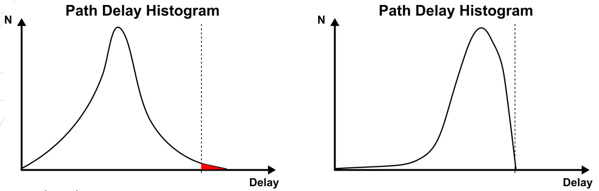

- Meet timing constraints provided to the design, using `set_critical_range`

- **Downsize** gates on non-critical path

- **Restructure gates** to $\downarrow$ Area, Power while maintaining positive timing slack

- Advanced designs also include **$V_{th}$ swapping** on non-critical gates $V_{th}$ to reduce leakage at delay cost

### Some Basic Synthesis Strategies

- **Keep sharable logic operations** in the always block

    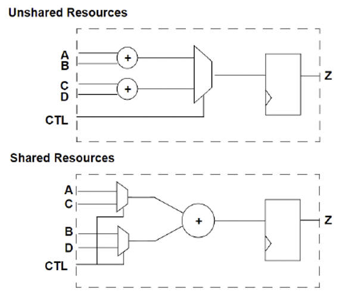

- Most effective when **the biggest and most complex possible datapath blocks** are extracted from the RTL code.
    
    - The most important technique to improve the performance of a datapath is to avoid expensive carry-propagations and to make use of redundant representations instead (like carry-save or partial-product) wherever possible.

    - Other techniques include level arithmetic optimizations (for example, common-subexpression sharing and constant folding).

    - **Sum of Product (SOP)**: Arbitrary sum of products (that is, multiple products and summands added together) can be implemented in one datapath block with one single carry-propagate final adder. Internal results are kept in redundant number representation (for example, carry-save) wherever possible.

        - `z = a * b + c * d - 483 * e + f - g + 2918`

    - **Product of Sum (POS)**: Limited product of sums (that is, a sum followed by a multiply) can be implemented in one datapath block with one single carry-propagate final adder (that is, no carry-propagation before the multiply). The limitation is that *only one multiplication operand can be in redundant (carry-save) format; the other operand has to be binary*.

        - `z = (a + b) * c`

        - `z = a * b * c`

    - **Select operation**: Select-operations (that is, selectors, operand-wide multiplexers) can be implemented as part of a datapath block on redundant internal results (that is, without carry-propagation before the select-op).

        - `z = (sign ? -(a*b) : (a*b)) + c`

    - **Comparison**: Comparisons can be implemented as part of a datapath block on redundant internal results (that is, without
    carry-propagation before the comparison).

        - `t1 = a + b; t2 = c * d; z = t1 > t2;` (`t1` and `t2` in carry-save only if not truncated internally)
    
    - **Shift**: Constant and variable shifts can be implemented as part of a datapath block on redundant internal results (that is,without carry-propagation before the comparison).

        - `t1 = a * b; z = (t1 << c) + d;`

- **Paritioning**

    - Team design/verification

    - Avoid combinational-only partitions
    
    - Establish FF-first of **FF-last policy** for each partition (we will use FF-last)

    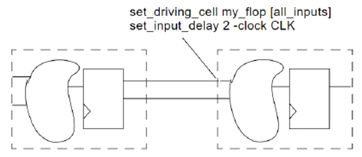

    - **Avoid paritioning the critical path into two partitions**

    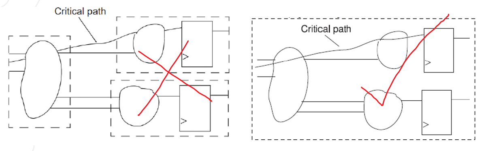

# APR (Automatic Placement & Routing)

Physical design process to convert netlist into physically connected primitives ready for GDSII export

## Flow Overview
```
FloorPlaning (Boundaries, Power Rings, Row Utilization)
                ↓
            Power Planning
                ↓
Placement (Wire-length reduction, Congestion Driven, Timing Driven)
                ↓
Clocking (Generated Clocks and Tree Synthesis)
                ↓
            Buffer-Tree Generation
                ↓
            Routing (Hold fixing)
                ↓
            Multi-voltage domains and UPF
                ↓
Chip Finishing (fill metal, FRAM creating, LVS/DRC checking)
                ↓
            Clock Gating

Finally get GDSII
```

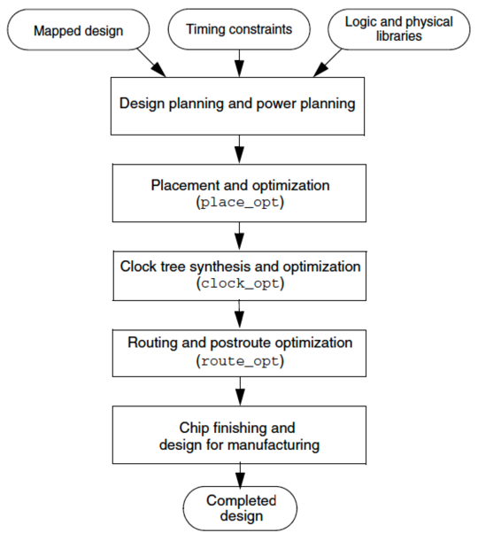

### Abstraction

- Only need BEOL only

- Standard cell layouts are just rectangular squares with pin shapes on them (**FRAM**) (Floorplan Routing Abstraction Model)

    - FRAM (abstract representation of the module)

        - Blockges (cell dimensions)

        - Pins

- Wires/vias are routing resources that can be put down on FIXED pre-defined locations called **tracks**


### Floorplanning

a. Core utilization based area specification

- Two ways to specify

    - Aspect ratio + Core utilization OR

    - Specific geometry settings (width and height in um)

b. Die-area vs. core area definition

c. Unit of measurement - um, tiles, super-tiles

- tile: Discretize into regular small squares, used for cabling resource, congestion, IR drop analysis

- power tile: In power analysis, each tile is also assigned power current/voltage information

- **Power Grid tile vs. super Power Grid tile**
    
    - PG tiles are small, local blocks of power grid (VDD/VSS) created over a defined region

    - A higher-level collection of PG tiles, stitched together to cover a larger region of the chip

    - **PG tiles ensure local cell rows have reliable VDD/VSS connections. Super PG tiles reduce overall IR drop across the chip by reinforcing the power network at a higher level**

d. Routing tracks

e. Stardard cell row sites

f. Power Rings

- power strap: The wide metal strip (VDD/VSS) laid inside the core area is used to send the peripheral power ring current to the inside of the core

g. Pin Placement

- Pin Placement is very important during chip-integration

- Common Problems:

    - Big designs with long runtimes, pins need to be in specific place. Adjustment causes full rerun multiple times

    - Should be done in a structured, less error-prone manner

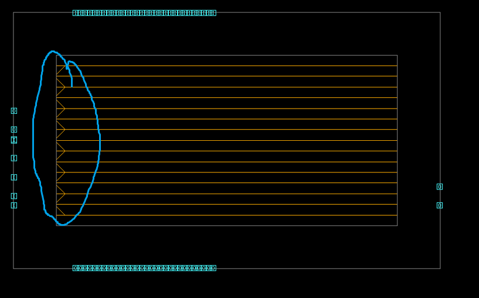

- Cell rows are placed in alternate **fipped way**

    - The reason is: The power rails/tracks (VDD/VSS) of each standard cell are fixed on the upper and lower sides of the cell. When the cells are flipped, then the adjacent rows can *share common VDD/VSS* and *reduce congestion*

### Power Planning

- Very well-organized framework for planning power rules

    - Otherwise, leads issuses like IR drops, EM effects

    - Multiple Voltages domains (clokcing I/O (usually larger than 1V), memory (usually smaller than 1V), logic, etc)

- Power Plan Regions (based on boundary, voltage_area, core)

    - Set a strategy for each power plan region

        - Power trunk definition: How to pull the main power line inside the area and distribute the current from the ring/strap?

        - Blockages (other power plan regions, layers): Power cannot be distributed in certain areas (e.g., storage macro cells occupy space, or areas across domains)

- OTM vs. Power ring based

    - OTM (On-Track Method): Powered directly from rail-style power cords on standard cell rows

    - **Power ring based delivery**: First draw a thick power ring (VDD/VSS) on the boundary of the core. Then use power straps to distribute the current inside the core

- The reasons for power grid uses wide and thick metal

    - Reduce IR drop: wide and thick metal $\rightarrow$ resistance $R \downarrow \rightarrow$ IR drop $\downarrow$

    - Reduce EM (electromigration): $j = I/A$，wide and thick metal $\rightarrow$ $j \downarrow$  

    - Improve power distribution uniformity
 
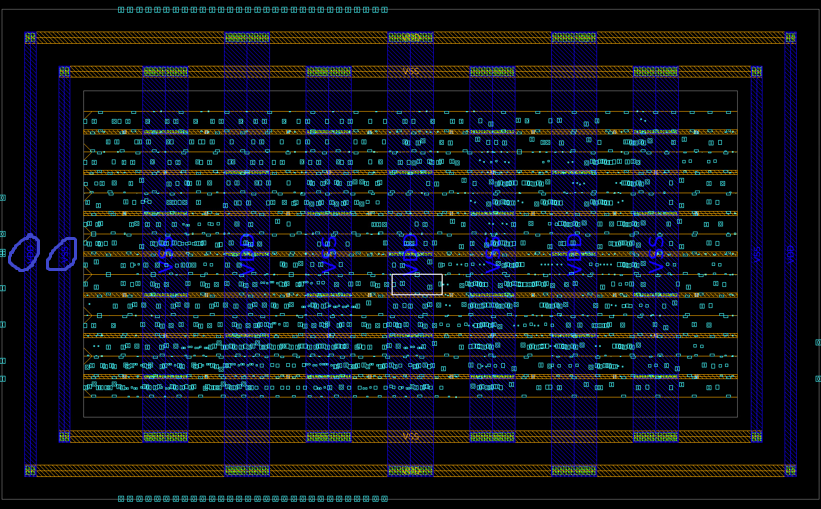

- Power Ring & strap

- Power Ring

    - Vertical trunk (in V-metal layer)

    - Horizontal trunk (in H-metal layer)

    - Cover the design area to feed power to the design from the periphery

- Strap

    - Rings connect to straps (vertically in this case)
    
    - Can also connect horizontally for a robust connection

    - Current flows over top metal (low resistance) to the heart of the design

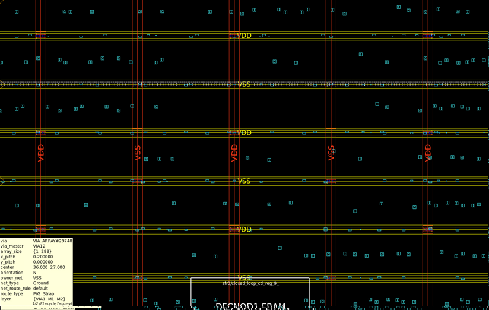

- Cell to power ring connectivity

### Placement

- Baisc cells to minimize routing length

    - Can direct toward specific objective (Timing/Congestion/Power)

- Fill cells also inserted to allow NW/PP/NP layer continuity (FEOL aware, but not FEOL inclusive)

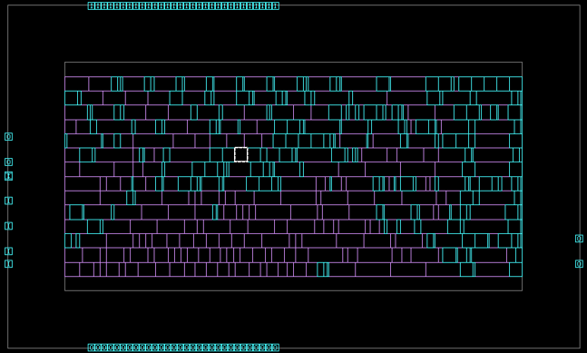

### Routing

```
Lowest      Poly Silicon Gate
            Contact
            M0 (L1, optional)
   ↓        M1 (first regular metal layer)
            M2, M3, ...
Higest      AP (used to connect with pad, powering ring, and large current)
```

- 65nm routing tracks in this class

    - M2, 4, 6, 8 Horizontal

    - M3, 5, 7 Vertical

    - AP usually reserved for special nets

- Horizontal tracks

    - Pitch = 0.2 um

    - Offest = 0.2 um

    - $y = 0.2n$

- Vertical tracks

    - Pitch = 0.2 um

    - Offset = 0.1 um (has to do with how cells are built-offline discussion)

    - $x = 0.1 + 0.2n$

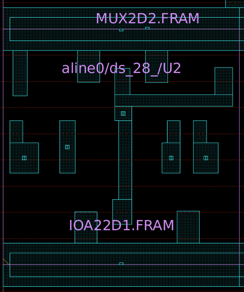

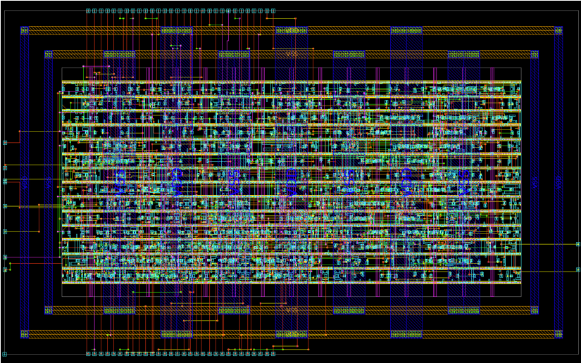

- Congestion can force routing tool to break rules (LVS/DRC violations)

- Alternatives

    - Global Routing, Congestion Driven Routing

    - Increase area (reduce row utilization)

# Pipelining

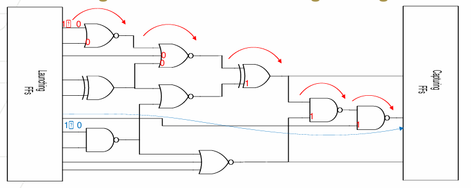

- Not every input combination excites the critical path

- **Max-delay**: Data inputs tarverse critical path of the logic

- **Min-delay**: Data inputs traverse shortest path (in a delay sense) of logic

As result the logic wavefronts are **diffused**

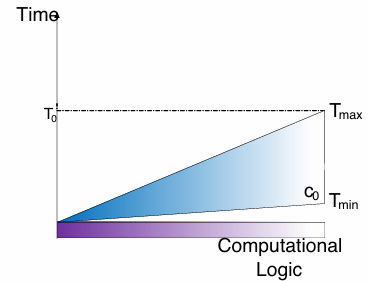

- Signals don't arrive at a logic gate output at a fixed time (depends on signal transition)

- Typically, critical paths are excited with a low probability (but must still be designed for)

## Wave Collision

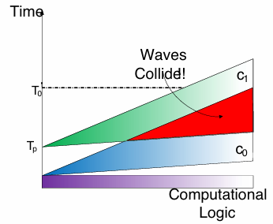

The formula for setup time is:

$$T_{cq} + T_{logic,max} + T_{setup} + T_{clk, uncertain} \le T_{clk}$$

So the frequence should be

$$f \le \frac{1}{T_{clk}} = \frac{1}{T_{cq} + T_{logic,max} + T_{setup} + T_{clk, uncertain}}$$

But when the pipelining is used, need to additionally ensure 

$$f \le \frac{1}{T_{logic, max} - T_{logic, min}}$$

- But it is very difficult to measure $T_{logic, max}$ and $T_{logic, min}$

- Because PVT varitation, SAPR-dominated design flows, poor-ROI will affect the meaurement

## Pipelining Exercise

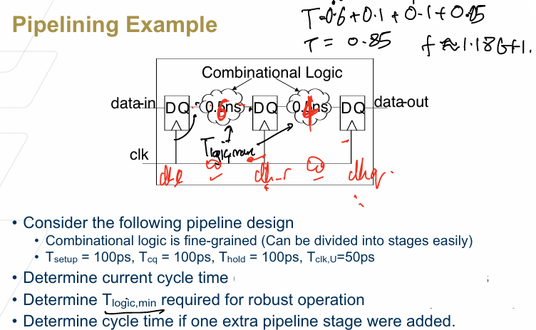

For current cycle time, it's directly

$$T_{clk} = T_{cq} + T_{logic,max} + T_{setup} + T_{clk, uncertain} = 0.1ns + 0.6ns + 0.1ns + 0.05ns = 0.85ns$$

For $T_{logic, min}$, use the hold up equation (Race Immunition):

$$T_{hold} = T_{logic, min} + T_{cq} - T_{clk, uncertaion}$$

$$T_{logic, min} = T_{hold} - T_{cq} + T_{clk, uncertain} = 0.1ns - 0.1ns + 0.05ns = 0.05ns$$

If one extra pipeline stage is added (combinational logic is fine-grained),

$$T_{clk} = T_{cq} + \frac{T_{logic,total}}{2 + 1} + T_{setup} + T_{clk, uncertain} = 0.1ns + 0.33ns + 0.1ns + 0.05ns = 0.58ns$$

## Pipelining Performance

For a combinational block, addition of N-pipeline stages impacts several parameters.

- Total latency (Ignoring area impact)

    - Absolute Time: $T_{logic} + N(T_{setup} + T_{cq}) \uparrow$

    - Total Cycle Time: $N T_{clk}$

- Throughput important (Ignore area*impact)

    - Pref. Improvement: $\frac{T_{cq} + T_{logic, max} + T_{setup} + T_{uncertain}}{T_{cq} + \frac{T_{logic,max}}{N} + T_{setup} + T_{uncertain}}$

    - Assume logic can be equally divied (fine-grained). Remember 
        
        - **Longest path sets delay of the stage**. 
        
        - **Longest stage sets clock perid of the design**  

- Area

    - $A_{N} = A_{logic} + \sum_i^NA_i$

- Power

    - $P_{N} = P + \sum_i^NP_i$

Consider an unpipelined design with $T_{logic} = 2ns$. Sketch the plot for cycle time vs piepline depth, N with $T_{setup}= T_{cq} = 0.2ns$

- The cycle time is: $T_{cq} + \frac{T_{logic,max}}{N} + T_{setup} = 0.4 + \frac{2}{N}$

- The asymptotic line is 0.4ns

## Parallel Processing

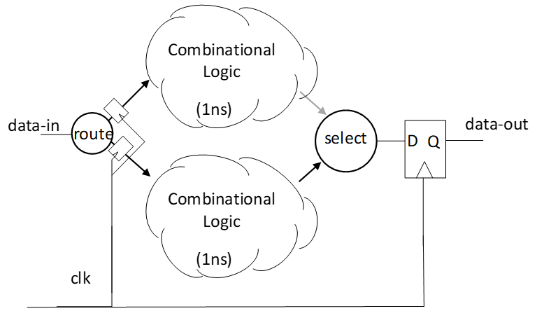

- Route incoming data in a round-robin fashion, collect in a round-bin fashion

- Dispatch outgoing data in an interleaved, round-bin fashion, collect in round-bin fashion.

- Overhead in the launching/capture FFs for clk-q/setup respectively

- The core is: **Clone Logic** + **Timing Interleaving**

### Pieplining vs Parallel Processing

- For some structures with feedback, the **data dependancies and feedback** between successive computations might be issues

    - e.g. MAC, Filter, Nueral Network

    - The feedback might distributed and cross multiple stages

    - Need stalling or bypass/hazard forwarding

- Design Methodology

    - Invasive vs. Less-invasive integration of constructed module

    - Some sturctures may be complex and huge enough, so direct change the sturcture or insert pipelines might not be a good choice.

    - OR use parallel processing methodology, clone logic and additional logic.

## Pipelining Case-Study

Consider a easy-to-pipeline computation (e.g. MAC) operation at 1 GHz target, Vdd = 1V, Vth = 0.4V, Tsetup = 100ps, Thold = 100ps, TclkU = 100p, and Tcq = 100ps.

The origin $T_{logic,max}$ can be obtained from:

$$T_{cq} + T_{logic,max} + T_{setup} + T_{clku} = T_{clk} = 1ns$$

$$T_{logic,max} = 1 - 0.1 - 0.1 - 0.1 = 0.7ns$$

When a single pipeline stage is added:

$$T_{clk, pipelined} = T_{cq} + \frac{T_{logic,max}}{2} + T_{setup} + T_{clku} = 0.1 + 0.35 + 0.1 + 0.1 = 0.65ns$$

However, there are some drawbacks of adding pieplining:

- More Power

- Larger Area

Now, I want to return to 1GHz. Other than un-pipelining, what are the options?

- Increase $V_{th}$

- Decrease $V_{DD}$

- Reduce gate width $W$

Let's pick the skill -- Decrease $V_{DD}$ to make the cycle frequecny of piplined MAC back to 1GHz. Then what value the $V_{DD}$ should be decreased to? Assume the $V_{th} = 0.4V$ and original $V_{DD} = 1V$

For long channel current model, we assuem the MOSFET works at saturation region ($V_{gs} = V_{DD}$), then

$$I_{on} = \frac{\beta}{2}(V_{gs} - V_{th})^2 = \frac{\beta}{2}(V_{DD} - V_{th})^2$$

The Gate delay would be

$$\tau = \frac{CV}{I} = \frac{C_L V_{DD}}{\frac{\beta}{2}(V_{DD} - V_{th})^2} = k \frac{V_{DD}}{(V_{DD} - V_{th})^2}$$

, where $k = \frac{2C_L}{\beta}$

Assume that the cycle time is only due to the date delay:

$$\tau_{pipelined} = T_{clk, pipelined}$$

$$\tau = T_{clk}$$

Then you can solve the new $V_{dd}$

$$\frac{k \frac{V_{DD}}{(V_{DD} - V_{th})^2}}{k \frac{V_{dd}}{(V_{dd} - V_{th})^2}} = 0.65$$

$$V_{dd} = 0.84$$

Furtherly, if still pick the skill -- Decrease $V_{DD}$ to make the cycle frequecny of piplined MAC back to 1GHz. How much dynamic energy could be saved per computation?

The dynamic energy dissipation per cycle is

$$E_{dyn} = C_LV_{DD}^2$$

Then you can save

$$\frac{V_{DD}^2 - V_{dd}^2}{V_{DD}^2} \times 100\% = 29.44\%$$

If the leakage for this block follows an expoential relationship: $I_{leak} = I_{n}10^{\frac{VDD}{0.7}}$ where $I_{n} = 1$ mA

Then the leakage current will be 

$$I_{leak} = 1 \times 10^{\frac{0.84}{0.7}} = 15.85mA$$

The leakage power is

$$P_{leak} = V_{DD}I_{leak} = 13.31mW$$

and leakage energy is

$$E_{static} = P_{leak}T_{clk} = 13.31mJ$$


### Effect of VDD Variability on Delay vs. Power

Roughly speaking:

$$\tau \propto \frac{1}{V_{DD}}$$

$$P \propto V_{DD}^2$$

**If VDD drops 20%, though delay would increase 20%, the power could reduce 40%**

Look at the below figure to have more idea about how *delay* and *power* are related

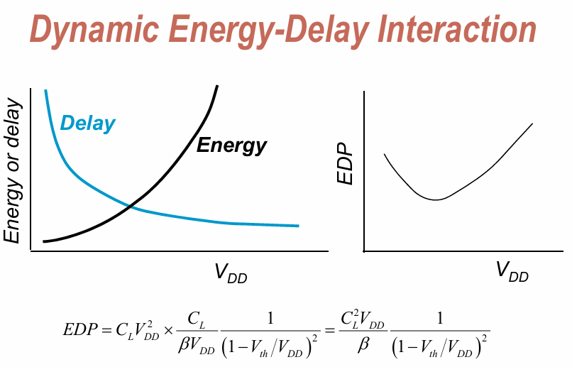

# Power

## Three main types of Power

**Dynmaic Power Consumption**

- Charging and Discharging Capactiors

**Short Circuit Currents**

- Short Circuit Path between Supply Rails during Switching

**Leakage**

- Leaking diodes and transistors

### Dynamic Energy Dissipation

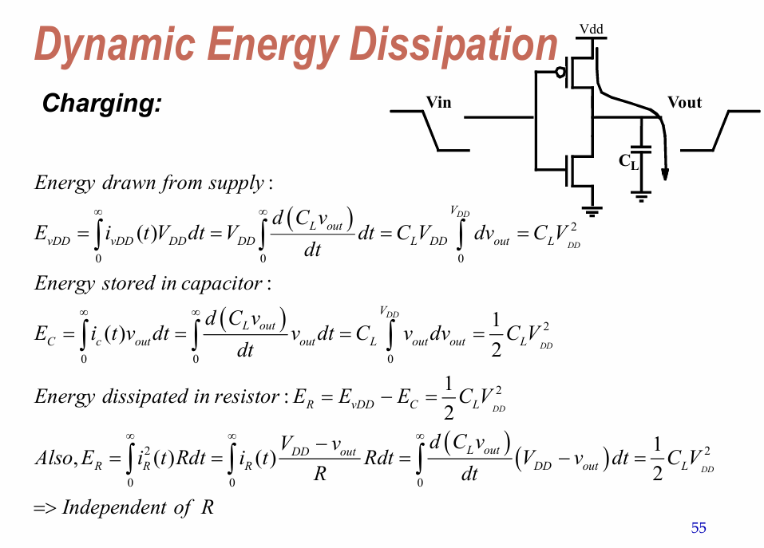

### Short-Circuit / Crossover Energy Dissipation

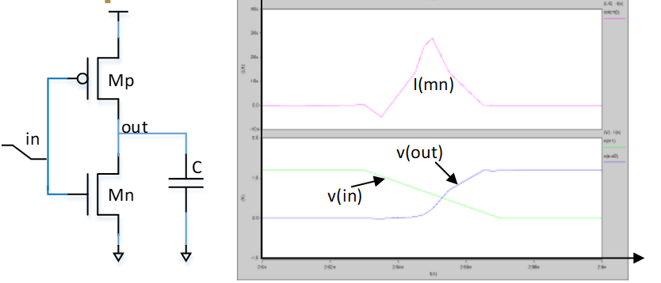

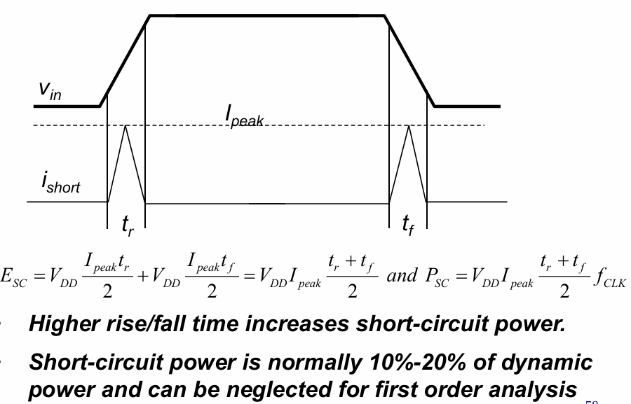

### Static Energy Dissipation / Leakage

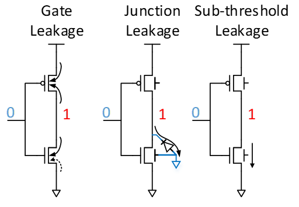

- **Gate-tunnel leakage**: happens at gate-oxide; when gate-oxide is extremely low and $V_{gs} \neq 0$;

- **Gate-Induced Drain leakage** (**GIDL**) (**Junction**): happens at high drain field, and lead to Band-to-Band Tunneling (BTBT); when short-channel, high $V_{dd}$ and $V_{gs} < 0, V_{gd} < 0$

- **Subthreshold leakage**: happens at channel; when short-channel, low $V_{th}$ (Drain Induced Barrier lowering) and $V_{gs} < V_{th}$

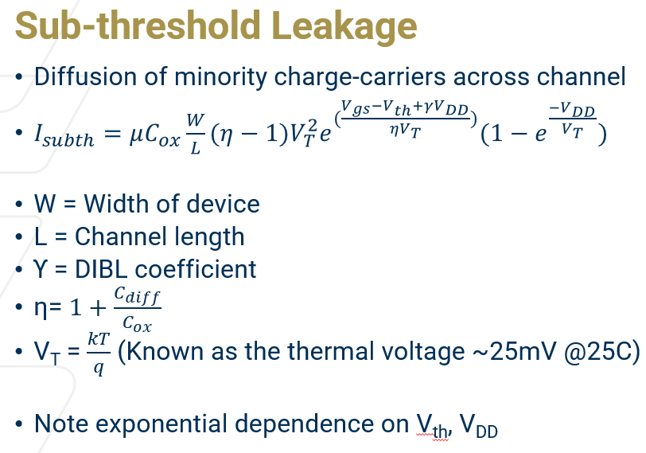

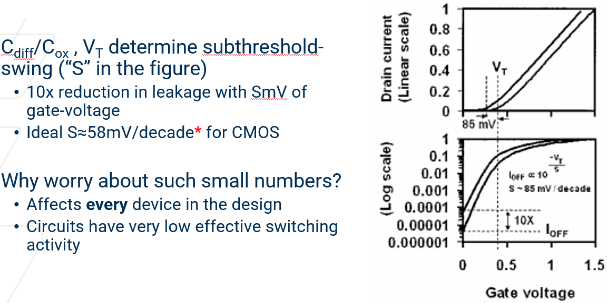

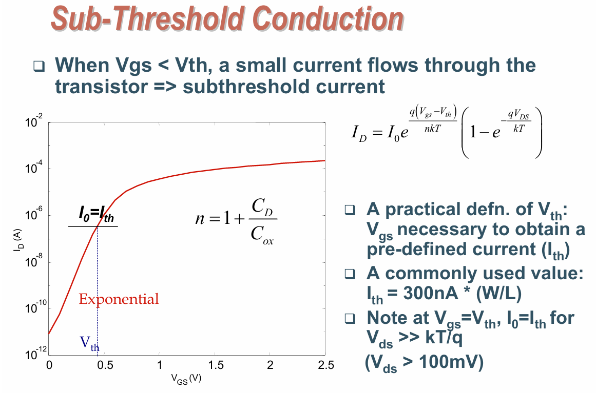

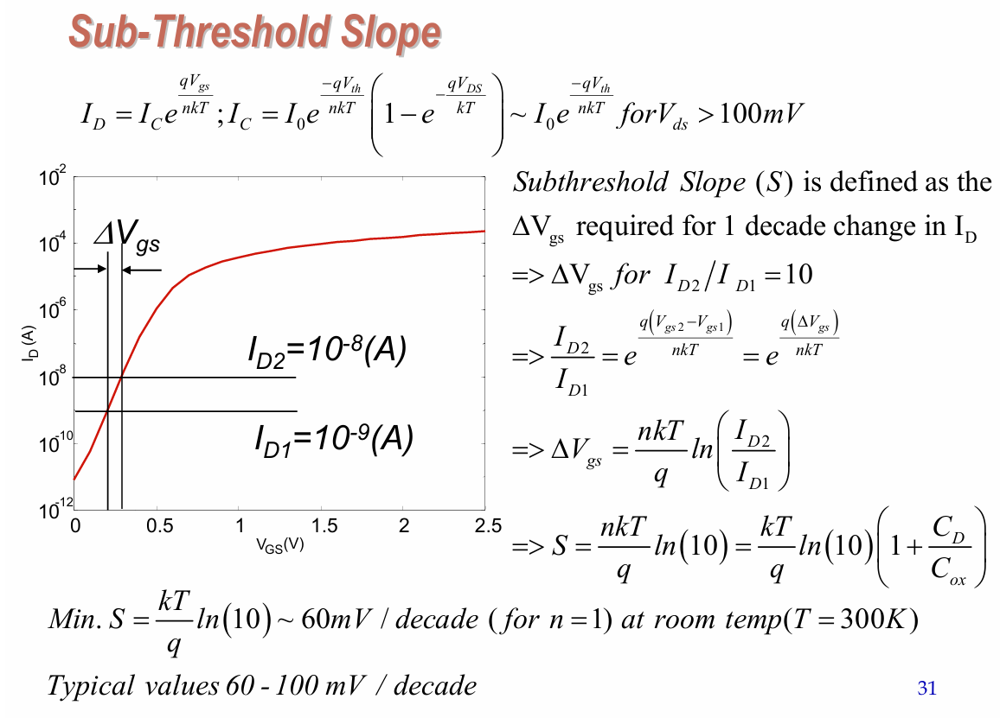

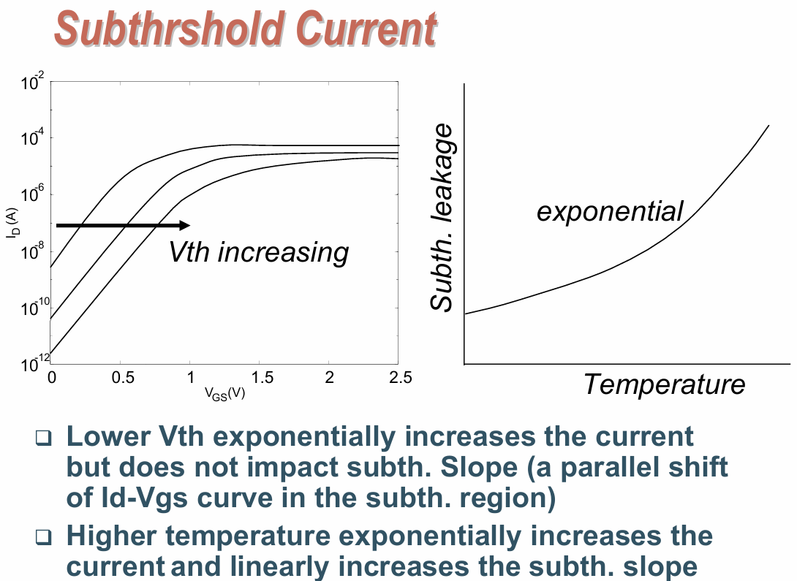

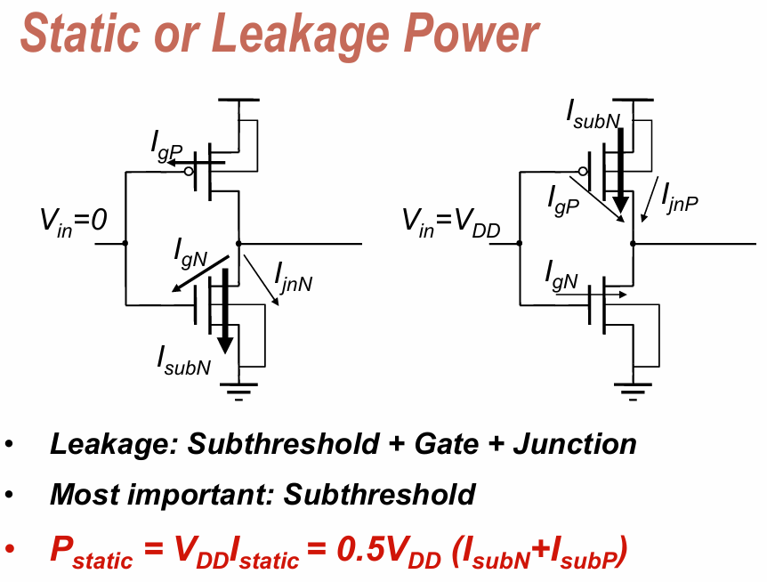

## Reducing Energy and Power in VLSI

Generally, the energy per gate per cycle is constituted by

$$E_{Total} \propto C_LV_{DD}^2 + V_{DD}I_{peak}\frac{t_r + t_f}{2} + V_{DD}I_{static}T_{clk}$$

The average power disspation per gate per cycle is

$$P_{total} \propto [C_LV_{DD}^2 + V_{DD}I_{peak}\frac{t_r + t_f}{2}]f_{clk} + V_{DD}I_{static}$$

Or simplified as

$$P = sCV^2f + P_{static}$$

To reduce the following items:

- **$P_{static}$** or $P_{leakage}$

    - **Power-gating**

        - Add a high-threshold "sleep transistor" before unused modules to cut off power

        - Static leakage of the module can be almost completely eliminated

    - Multi-Vth design

    - Device stacking (stack effect)

        - Multiple CMOS in serial and reduce $I_{cutoff}$

- **s**: Switching activity factor

    - **Clock-gating**

        - Turn off clocks for inactive modules to avoid unnecessary rollovers

    - Hierarchical evaluation techniques (memories)

    - Bus-encoding
    
        - use Gray code, Bus-Invert etc to reduce signal flips

    - Glitch avoidance

- **C**

    - Logic Downsizing/Mininization

        - Reduce gate size and capacitance on non-critical paths

    - Logic-Wire co-design

        - Logic optimization and routing are considered simultaneously to reduce interconnect capacitance

    - Caching

        - L1, L2, L3 cache

- **V**

    - **Design-time voltage scaling**

        - Run at the lowest possible voltage **during the design stage** to ensure that the timing is met

    - **Dynamic Voltage-Frequency Scaling** (DVFS)

        - Dynamically adjust voltage and frequency simultaneously **in real time**, reducing V and f when the load is low

    - **Adaptive Voltage Scaling** (AVS)

        - Adjust Vdd based on process, voltage, temperature (PVT) **in real time** to avoid excessive headroom

    - Voltage Margin Minimization

        - Reduce the voltage margin in the clock/logic and push Vdd to a level that is just right for running

    - Low-swing techniques (logic/signaling)

        - Reducing signal swing in inter-chip/on-chip interconnects, such as using 0–0.5V instead of 0–1V, reduces dynamic power consumption at full swing.

    - **Retention-mode**

        - When the circuit is idle, it enters an ultra-low power consumption holding state and only maintains the minimum voltage to ensure that the register does not lose data.

- **f**

    - **Dynamic frequency-scaling** (DFS)

        - According to different loads, reduce clock frequency when idle to reduce dynamic power consumption

Adjust terms involves **tradeoffs** (cost, robustness, performance, feasibility)

### Controlling Leakage: Multiple Vth design

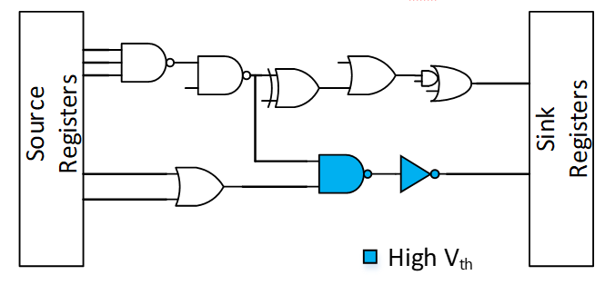

Design digital circuits with a palette of multiple Vth devices

- HVT: Use on non-critical paths to reduce leakage

- RVT: Use on the majority of devices

- LVT: Use on specific gates on the critical path (be very careful)

Gate-length biasing to module Vth (at expense of dynamic power)

### Effect of Vth Variability on Delays vs. Power

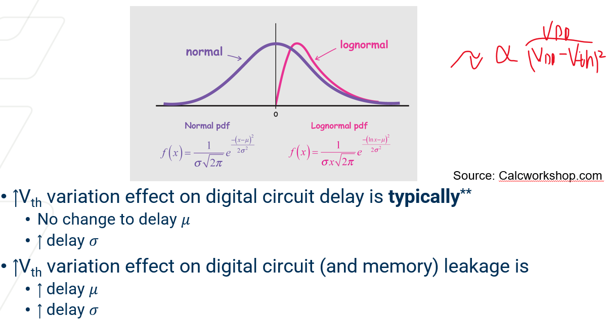

**Delay distribution is normal distribution while Leakage distribution is more like Lognormal pdf**

- The **increasing $V_{th}$ varitation** effect on digital circuit delay is

    - No change to delay average $\mu$

    - increase delay variation $\sigma \uparrow$

- The **increasing $V_{th}$ varitation** on digital circuit (and memory) leakage is

    - increase the leakage average $\mu \uparrow$ (pay attention, this is Varitation of $V_{th}$, not $V_{th}$)

    - increase the leakage average $\sigma \uparrow$

### Controlling Leakage: Power Gating

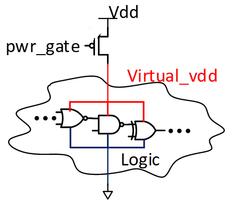

- Connect the logic to the grid when operating

- Disconnect from the grid when in sleep state

    - User a "header" or "footer" device to connect/disconnect the entire logic to the supply. Common virtual power/ground

    - Provides crucial decap (decoupling capacitor)

        - **Provide instantaneous current when the circuit suddenly switches to avoid voltage droop**

        - **Suppress voltage fluctuations on power lines** and reduce SSN (simultaneous switching noise)

    - Reduced power gate width (current sharing)

        - Module level current sharing, like ALU, cache etc, they have their own power gates

        - Timing current sharing, when circuit is active from sleep mode, not all the circuit become active at the same time, instead, they become active in multiple stages. In each stage, only a part of current need to wake up

- But power gating / pesudo PMOS (header) still have leakage current problem

    - FET width and $I_{on}$/$I_{off}$ key to this method

    - Needs to be wide enough to have negligible IR drop

    - $W \uparrow \rightarrow$ Leakage $\uparrow$

    - Switching activity, $I_{on}$/$I_{off}$ and transistor gain are the key.

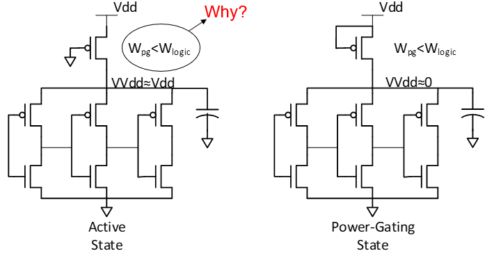

The reason why we usually choose $W_{PG} < W_{logic}$?

- Think about the sleep mode, a wide power-gating transistor will have larger leakage current

- This will 'precharge' the those below Operating Circuits, failing to make the voltage $V_{dd}$ drop to 0

#### The power-gating FET Width

$g_{ds}$: Conductance of power gate per micron of FET

$c_{sw}$: Capacitance of switch per micron of FET

$K_g$: Relative conductance of power FET compared to load

$w_{pg}$: power gate width (the one need to design)

$w_l$: total logic FETs width

$k_{wire}$: Multiplier to $w_l$ to account for wiring load

$$g_{ds}w_{pg} = sCfK_g$$

$$w_{pg} = \frac{sCfK_g}{g_{ds}} = \frac{sc_{sw}w_lk_{wire}fK_g}{g_{ds}} = \frac{sk_{wire}fK_g}{g_{ds}/c_{sw}} w_l$$

Given s = 0.3, $g_{ds}$ = 0.001, $k_{wire}$ = 2, $f$ = 1 GHz, $K_g$ = 100, $c_{sw} = 10^{-15}$, then $w_{pg}$ = 0.06 $w_l$

$I_{off}$: leakage per micron of FET

Assume half of time, leakage will be on a single stack

At another half of time, leakage will be stacked with 5 MOSFET (due to stack effect, the $I_{off}$ is only 1/5)

So the original leakage current without power gating PMOSFET is

$$I_{leakage, logic} \approx w_l(0.5 + \frac{0.5}{5})I_{off}$$

While the leakage on the power gating PMOSFET is 

$$I_{leakage, header} \approx (0.06w_l)I_{off}$$

$$\text{Leakage Reduction Factor} \approx 10$$

- When $f$ = 3 GHz, the $w_{pg}$ will become 0.18 $w_l$, the leakage reduction factor will become 10/3

- The clock is full of buffers, often lower $V_{th}$, the current leakage is more serious, and can also power gating as well

- When choose footer to work as "virtual GND", the width/area could be smaller than header, but the current leakage will be larger.

- [More Readings about Power Gating](https://anysilicon.com/power-gating/)

#### Power Gating: Physical Considerations

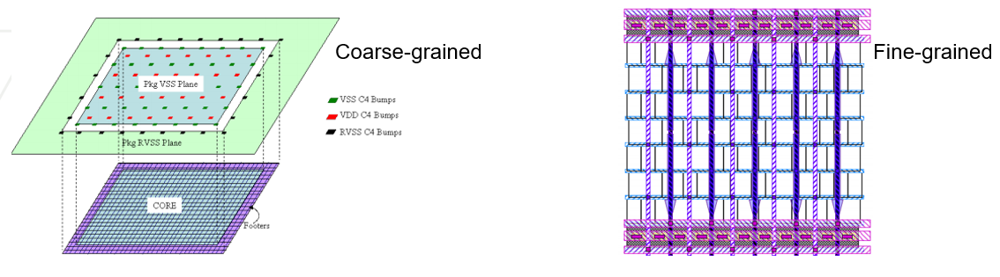

Different physical implementations of power gating

- Varifying challenges on EM/IR. Choice depends on available technology and architectural feature support

- Actual header resistance smaller than interconnect resistance in high performance designs

#### System Considerations

In-rush current can cause significant noise on supply

- **Wake-up sequencing techniques** for in-rush current suppression

Memory retention need to hold

- **Retention Flip-Flops**

- **Offload** to SRAM/DRAM

- The **write-back** cached data need to **write-through** to SRAM/Main Memory

System level considerations and implications

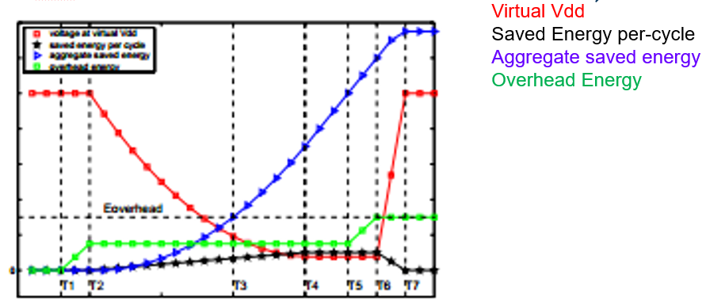

- Cost of entry-exit

    - The sleep time must be a long time, so the saved energy can overtake the energy need to enter/exit the sleep mode.

- $V_{th}$ targeting for logic

### Controlling Dynamic Power: Reduce Switching Activity 's'

**Reducing glitches**

- Tough one. Try to keep paths balanced

- Avoid a ripple-carry adder like situation (...1111 + ....1110 -> ...1111 + ....0001)

**Hierarchical search techniques (e.g. Way-prediction)**

- Predict which block of the cache will result in a tag hit (way prediction)

- Avoid doing a memory access and tag lookup on all 4 blocks

- Need a high probability of success

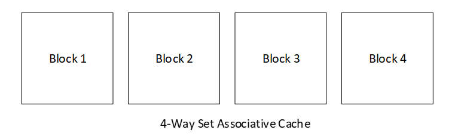

**Clock Gating**

- One of the most important techniques for power reduction

- When talking about levels or hierarchies of clock gating, there's **Fine-grain** clock gating and **Coarse-grain** clock gating.

### Clock Gating

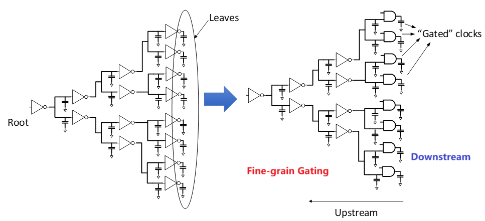

Each "level" of the clock distribution switches $\uparrow$ amount of capacitance

Clock net s = 2 ($\approx$ 10x - 20x activity of logic net)

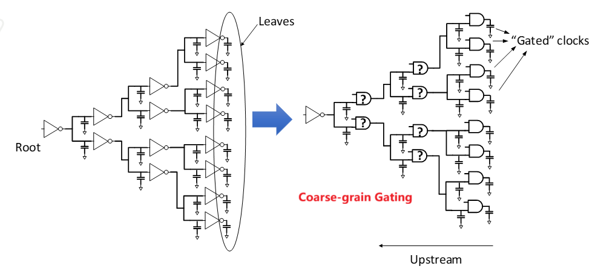

#### Gater Timing Considerations

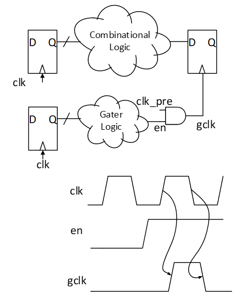

- This case is not so good, though we en-able before raising edge of clk

- But you cannot always control when the data is coming, which could lead a glitch

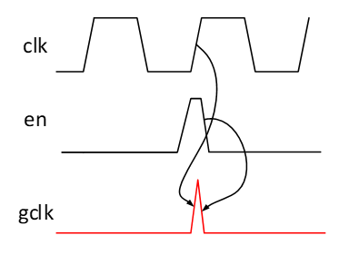

- This case is bad, as we deassert the en-able during the raising edge of clk

- As a result, a unexpected glitch gclk is generated

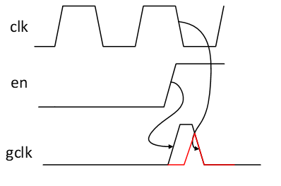

- When you en-able at the first half of the current, the enable raises and clk falls at the same time

- An unexpected glicth (the red pin in the figure) is also generated

Fix: **Insert a half-cycle delay**

#### Gater Design

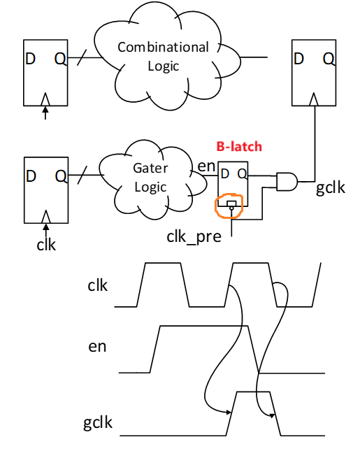

**Use a B-Latch** to insert a half-cycle delay

- B-Latch: back half/bottom phase

- When clk is low, B-latch is transparent, sample en-able

- When clk is high, B-latch is opaque, hold en-able

Can I just use buffers to guarantee > 1/2 cycle delay?

- No

- Adding buffer only increases the fixed delay, but does not guarantee phase stability

- Delay will drift due to process, voltage, temperature (PVT) changes

#### Practical Clock Gating (with SAPR tools)

- Don't need to explicitly write down latch/and-gate arrangement in Verilog (in fact not recommended)

- Libraries have intergated clock gates (ICGs) - Latch-AND combos

- **Write a Mux-D statement, invoke clock-gating in Syn, APR**

**Discussion**

Upstream Clock Gating vs. Downsteam Clock Gating

- Upstream can save more dynamic power but has higher timing complexity and physical design difficulty

- Upstream makes the DFT design more complicate

Why do I need a faster clock gater?

- improve response time and thus redeuce power

- reduce unnecessary pipeline activity

- reduce glitch / timing hazard

What's gater setup?

Like setup time, gater setup ensures **gating latch can sample en-able signal correctly**. 

en-signal should be stable before the rising edge of clk.

Violates gater setup time, could lead glitch, or gated clock delay and trigger following registers wrongly.

When synthesis and STA, the tool will add constraints on clock gating

```tcl
set_clock_gating_check -setup <time> -hold <time>
```

### Reducing Dynamic Power: Voltage scaling

#### Design-time

**Piepelining** -> **Voltage-scaling**

- Need to support separate voltage island for that block

- Apply technique to the entire chip (very rarely possible)

**Parallelism** -> **Voltage-scaling**

Dual-Vdd designs

Voltage islands (arising from pipelining/parallelism or performance slack)

#### Run-time

AVFS: Apdative Voltage and Frequency Scaling

AVS: Adaptive Voltage Scaling

DVFS: Dynamic Voltage-Frequency Scaling

Retention-mode (Memories)

# Design of Testability

There could have processing defects/faults/errors in the chip manufacture processing.

- Metal 1 Shelving

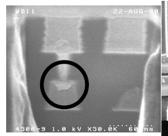

- Metal 5 film particle (bridging defect)

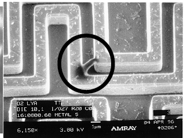

- Open defect

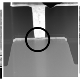

- Spongy Via2 (Infant mortability)

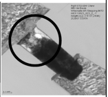

- Metal 5 blocked etch (patterning defect)

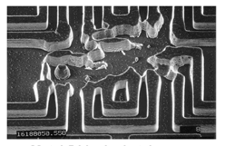

- Spot defects ("Co" Defect under Gate)

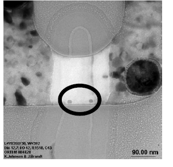

- Metal 1 missing pattern (open at constant)

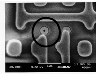

Why should I bother with Testing?

Because Testing accounts for significant source expense in IC production

- Chips are getting larger (few defects can be tolerated outside of memory)

- More Tx/$mm^2$

- Must vaildate exhaustively (Shipping a failed part can do permanent damage)

- Brute Force Testing of thoughtlessly designed hardware is SLOW at best, inadequate at worst.

    - May be able to identify functional failure, but not parameteric failure (ICs are fast)

    - "Tester Time" is expensive

- Design with testability in mind

    - Complex chips typically don't work first-time. Silicon debug is important

- Thoughtful design will allow rapid, effective testing.

## Post-Silicon Test Stage

### Testing Early (wafer)

- Avoid cost of packaging the chip

- But limited ATE equipment, limited speed $\rightarrow$ Expensive: Do only the really important $\rightarrow$ Limited coverage

### Testing Late (Packaged parts)

- Much more comprehensive. Testing trays and trays of processors concurrently is possible

- But finding faults this late is expensive

## Scan Chain Design

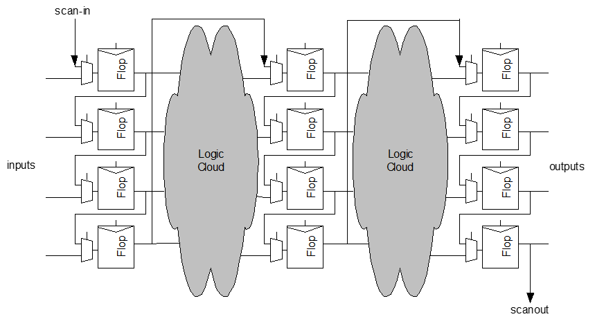

Designs are inherently **Pin Limited**

- 100s of pins (at most), hundreds of thousands of signals to be controlled/observed

- Imagine debugging your design without access to any internal signals

**Idea: Trade off access to states for speed (Allow lots of time to be able to access lots of bits)**

### MUXD style

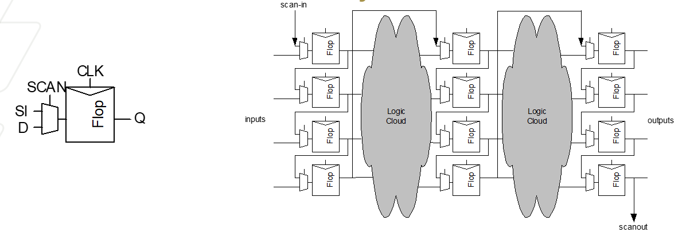

Add mux in front of FF

- Pick whether to sample scan_chain signals or datapath signal

**Typical flow**

- Turn scan_en. "Weave" through the design to drive logic input and sample logic output

- De-assert scan_en, allow logic outputs to drive "D" pin

- Pulse clk

- Assert scan_en again, weave signals out of the design

The Challenge is **At-speed** test:

- In scan-chain, the test signal are implemented using "scan_in/scan_out in serial", which could be very slow.

- But "at-speed" usually requires the test clk aligns with the real clk.

- The bottleneck could be "How to switch to a high-speed pulse clk after weaving the logic input" AND "How to safely weave signals out of the design without changing the states"

What would possibly go wrong with back-to-back connected flip-flops?

- There is no logic delay between two back-to-back connected flip-flops.

- In the high-speed testing, the hold time violation could happen.

### LSSD(Level-Sensitive Scan Design) style

- Separate clocks to control B and A Latch (folded into the clock gater)

- Custom FF: Wedge scan path into the feedback of the B latch $\rightarrow$ high speed

- Pulse clocks non-overlapping to avoid race!

The work flow can be 

**Scan in -> Update -> Run -> Capture -> Scan out**

## LSFR (Linear Shifter Feedback Register)

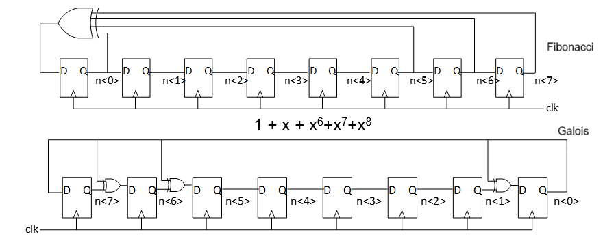

Capable of generating a pseudo-random number sequece

- E.g. n-bit LFSR will go through all $2^n$ possibilities in a pre-determined sequence

- Uses a generator (primitive polynomial) to produce all entries of a finite field

- Implementations fall under 2 types (Fibonacci-type and Galois-type)

- Primitive polynomial tables readily available for n-bit LSFRs

Used in Built-In Self Test (BIST)

- Pseudo-random "data" generation for Datapath test

- Compression of output data

## Signature Analyzer (AKA Compressor)

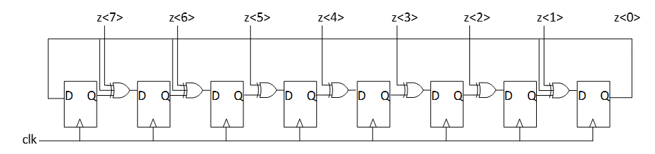

Start with a basic LFSR structure

- Incorporate XOR at each input

- Data output from a digital block "mixes" into pseudo-random sequence

- Run test for many cycles, observe signature

- Hashing: Single-bit output error will result in a significantly different signature

- If signatures match, it is very likely that there was no error in any computation

## If finding bug post-silicon, what can we do to fix them?

**Software/Firmware patches are cheapset, then metal-only respins, then full-respins**

Engineering Change Order (incremental updates to design - leave everything else untouched)

- If really lucky, fix may only involve a few upper metal layers (rare)

- Use spare cells (FETS in the FEOL) to put together a logic-gate/hold fix to your design

- Will need to change metal layer masks from CA $\rightarrow$ Mx (Highest metal involved) to wire up spare cells, re-write logic

# Reset

**System must correctly exit reset-state per FSM description**

**The way most of the designs have been modelled needs asynchronous reset assertion and synchronous de-assertion.**

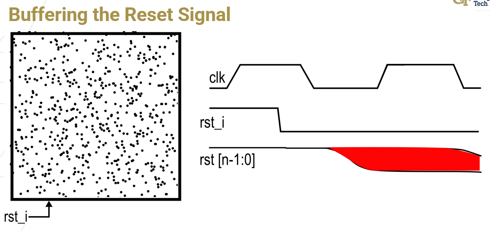

But there could be delay from the top level reset to each pin level of reset in the 30K flip-flops

Why do I need a buffer to begin with? Why not use a large central buffer to distribute reset?

- Reset Fanout, 1 buffer/driver is far less than the requirement

- If only 1 buffer/driver, then the distributed reset signal could have large skew

- IR drop & EMI

## Synchronizing your reset

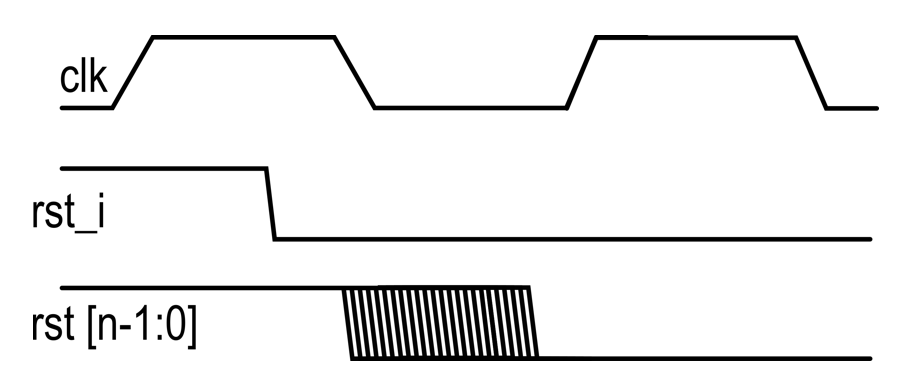

**You must ALWAYS synchronize your reset**

All signals in a synchronous system **must comply with clock constraints**

- **Setup/Hold**

- **Recovery/Removal (Specific to reset)**

There are two reset synchronizer:

(1) The traditional one (which is same as the asynchronous input synchronizer)

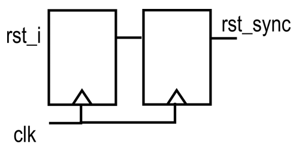

(2) The new one (the input is always connect to Vdd, and rst_i is passed in as well)

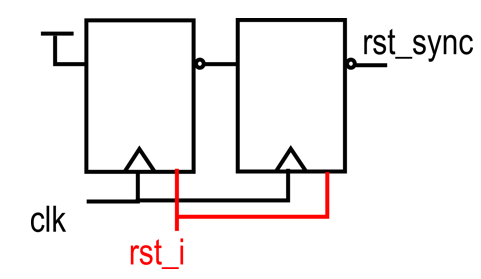

Make sure the delayed rst [n-1:0] come before next positive edge

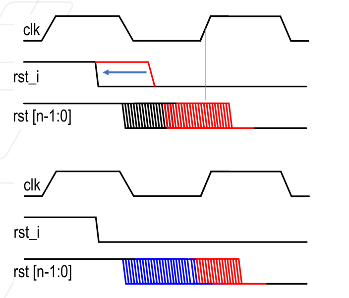

```verilog
module reset_synchronizer (
    input  logic clk_i,
    input  logic asy_rstn_i,
    output logic syn_rst_r2
);

    logic syn_rst_r1;

    always_ff @(posedge clk_i or negedge asy_rstn_i)
        if (!asy_rstn_i) {syn_rst_r1, syn_rst_r2} <= 2'b00;
        else {syn_rst_r1, syn_rst_r2} <= {1'b1, syn_rst_r1};

endmodule
```

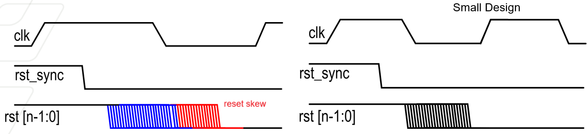

Buffer trees are usually also sufficient if

- Design is adequately small or low $f_{clk}$

Typically not sufficient for either largr or high $f_{clk}$ designs

Meanwile, your timing tool expects all signals to arrive at the flop within 1 cycle

## Solutions 

1. Just keep resetting until you exit out of reset correctly

2. Reset on the failing edge!

- This could have one more half period for reset recovery (if sampling at posedge of clk) 

3. Reduce the clock frequency, exit reset, then adjust the clock frequency

4. Set the reset signal to be a multipath signal

## Pipelining Reset

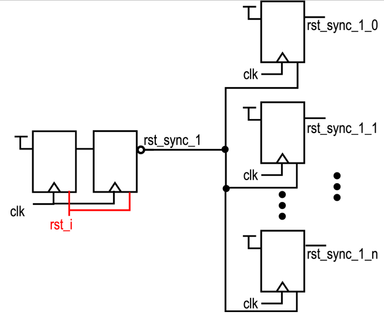

**Key idea**: Think of the reset tree as a large logic stage (multiple-cycle path)

Leaf-node reset signals of a pipelined reset tree

- Take multiple cycles from rst_i to the leaf nodes

- All transaction within the same cycle (# of pipeline stages)

Synthesis won't automatically insert reset pipeline for you excpet your retiming/pipelining constraints set

Even your design has pipeline you still needs to synchronize reset signal, otherwise the first beat could be meta-stable.

## Synchronous vs. Asynchronous Reset Flops

### Synchronous flop

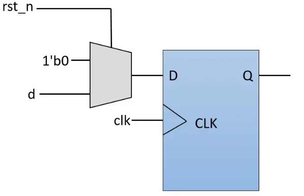

Be careful when using synchronous flops ... (especially, with feedback logic)

- Unless specifically told, synthesis will "optimize" the reset logic and potentially pollute it with other logic signals that could be "x" at t=0.

- Result: Flops is "x" on reset

Use the methodology below to make sure you get the desired behaivor

- Set app_var to honor synch reset:

```tcl
set_app_var compile_seqmap_honor_sync_reset_true
```

- Then use the `sync_set_reset` directive to tell the compiler to use connect selected signals to the "reset" pin of synchronous flip-flops (if available), or use D-flip flops with reset in front of the D-pin in a manner that avoid inadvertently allowing "x" to propagate through logic into your flip-flop-D pin. **This entry is a compiler directive that is written in your verilog**

```verilog
// synopsys sync_set_reset <signal_name_list>
```

## Reset and Power Grid Interactions

Functional View: Releasing reset brings my design to life!

**Power Distribution View**: Releasing reset causes a huge current surge!

- Imperfect power delivery $\rightarrow$ $I_{load} \uparrow$ $\rightarrow$ huge $V_{dd}$ drop $\rightarrow$ timing failure out of reset

Solution: Come out of reset gracefully

- Sequence Reset de-assertion in clusters

- Throttle clock for some cycles at the onset of reset

### Snippet codes

Snippet of Verilog/Systemverilog code with synchronous

```verilog
always_ff @(posedge clk_i)
    if (!rstn_i) q <= 0;
    else         q <= d_i;
```

Snippet of Verilog/Systemverilog code with asynchronous

```verilog
always_ff @(posedge clk_i or negedge rstn_i）
    if (!rstn_i) q <= 0;
    else         q <= d_i;
```

Snippet with `always @(posedge clk or reset)` (Bad One!!!， this is level sensitive, like a latch) 

```verilog
always @(posedge clk or reset)
    if (reset) q <= 0;
    else       q <= d_i;
```

# Memory

Objectives

- Dominant source of Tx count, area in many modern CMOS systems

- Increasingly key to system performance

    - On-chip: Regsiter files, Cache memory

    - Off-chip: Main memory storage (DDR), Solid-state drives

- Key properties

    - Density (bit per $mm^2$)

    - Latency (e.g. cycles to access)

    - Bandwidth (very important in today's AI acceleraters and data center)

## Memory Hierarchy

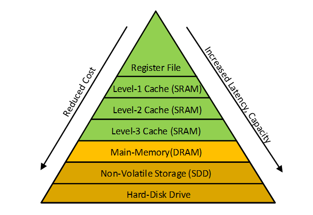

- Memory systems typically made up of hierarchy of different memory structures (cost, latency, bandwidth, capacity)

- Performance impact mitigated by

    - Locality of reference

    - Arithmetic intensity

## Array Organization

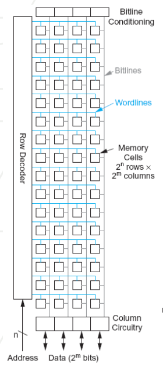

- Random Access $\rightarrow$ Arbitrary data access order

- $2^n$ entry RAM (the address/set)

    - Query SRAM with n-bit address A[n-1:0]

    - Obtain $2^m$ bit data (2^m is block size of data)

    - 2MB memory with 64-bit data as a block

        - n = 15, m = 6 (**Directly mapped**)

Another way is **associative mapped**

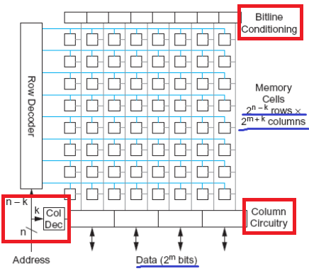

- $2^K$ blocks are put in a line (set)

- The row lines decreases, data broadcaset/column lines increases

- Additional notation

    - Bitcell

    - Ports

## SRAM

### Bitcell Structure

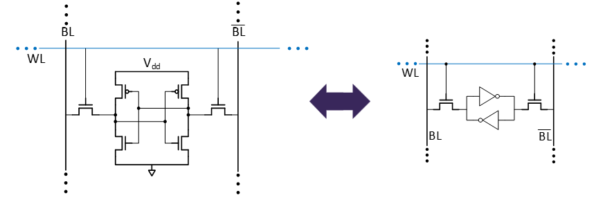

- Area matters! (Bitcell replicated > $10^6$ times)

- Wordline turns-on access transistors (only NMOS to save area)

- Cross-Coupled inverter structures enable static data storage

- **Bitline is highly capacitive** (wire-load, bit-cell loading)

    - Driving bitline to 1 is difficult, area consuming

    - Pre-charge the bitline to $V_{dd}$, bitline only responsible for pull down

    - Read circuits in large memory structures don't wait for bitline to reach rails

    - Need for dual-rail bitlines (Differential vs. single-ended sensing) (more Mats)

### Operation (Read)

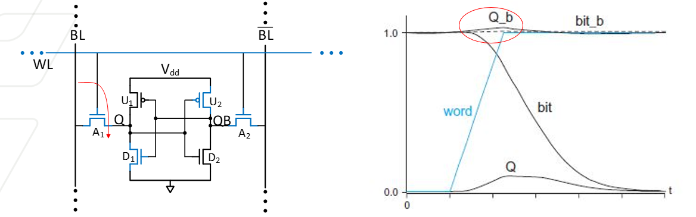

- Precharge bit-lines to $V_{dd}$

- Activate word-line (turn on access transistors)

- Voltage divider with $A_1$, $D_1$ as Q pulls bit low, experience voltage rise

- $Q_b$, bit_b polarities match (bit_b weakly helps stabilie $Q_b$)

- Q pulled down to gnd through $D_1$

### Array Read Timing

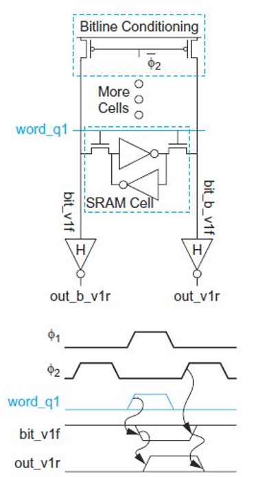

- 2-stage process

    - 1st stage: precharge bitlines

    - 2nd stage: access bitlines

- bit_v1f does not have to go to 0

    - Differential read performed by sense-amplifiers

### Operation (Write)

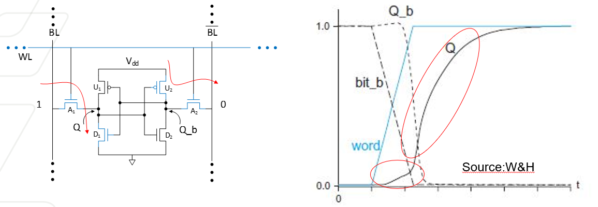

- Memory hierarchy (cost, bandwidth, latency)

- Basic Array Structure

### Stability

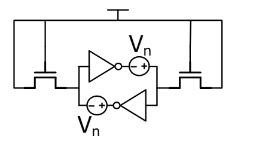

- Fight during read and wirte operation in a latch can result in destructive reads and incomplete write

    - Bitcell tradeoff between size and robustness ($V_{min}$)

    - Bitcell relative sizing in descending order? **Pulldown, Access, Pullup**

- Static Noise Margins are popular for stability anslysis

    - $V_{th}$ variations are significant source of instability ($\rightarrow$ Static margin analysis)

    - DC representation and analysis of a transient phenomenon

    - Miliions of cells, PVT variation over a broad area

    - Heavily statistical in nature

- Tension between read stability (make M_{pd} strong) and writability (PMOS cannot overcome even weakened NMOS)

### 8T, 10T cells of SRAM

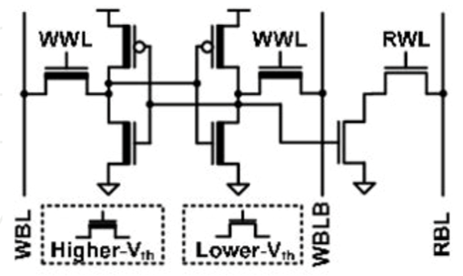

Help make memories at lower $V_{dd}$

But 8T, 10T cells (trade-off density/capacity for $V_{dd}$ scalability)

## DRAM 

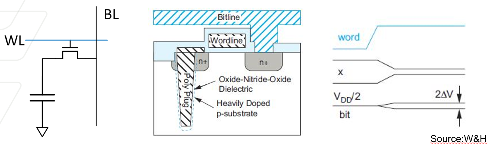

- Memroy content storeed as the charge on a capactior (Refresh needed)

- Very high density (order of magnitude higher than SRAM)

    - Special processing needed (Trench Capacitor). Typically incompatilble with CMOS

- **Read Operation**

    - Precharge bit-line to $V_{DD}/2$

    - Turn on access transistor

    - Detect small-signal transition on bitline, **amplify and regenerate** bitline to write-back data

- **Write Operation**

    - Drive bitline

    - Enable Access Transistor

    - Charge/Discharge node

## ROM

### NOR ROM

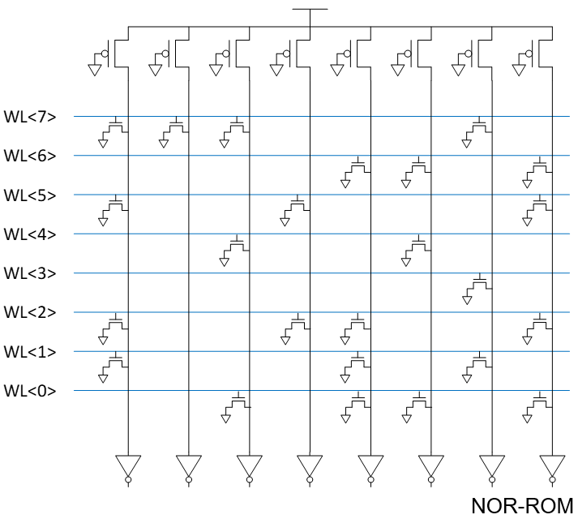

Most compact on-chip memory storage

- Microcode in processors

- Signal processing (FIR Filters, FFT coefficients)

2-variants

- Pseudo-NMOS logic based NOR gates

- Pseudo-NMOS NAND ROM

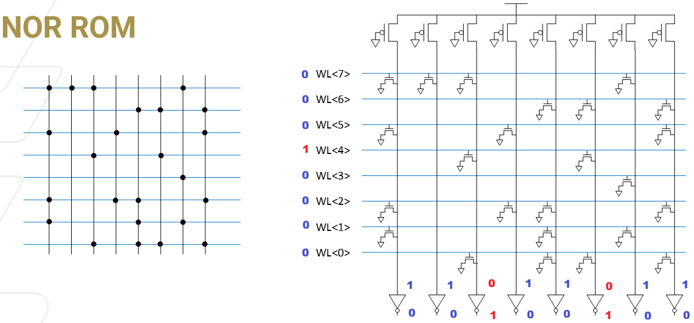

Pseudo-nMOS NOR implementation (Avoid long, slow pullup)

- **Parallel NMOS connections**

- **No full-rail swing** (can only pull up to a pseudo-nMOS's high level voltage)

For a given wordline, connect tx to bitline if corresponding bit is 1

- Selection of wordline (active-high) pulls down bit-line, transitions output to 1

### NAND ROM

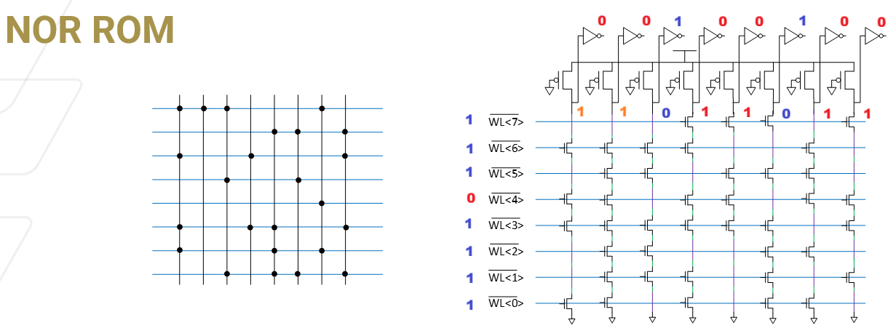

Peseudo-nMOS NAND implementation

- **Series nMOS devices (Slower than NOR)**

- **No full-rail swing**

**Decode lines are active-low**

- If transistor is present, and WL = 0, then BL remains high, output is low

- If transistor is not present, metal connection, and WL = 0, then BL pulldown, and output is high

- **Insert transistor where you want to program a 0**

## Content Addressible Memory (CAM)

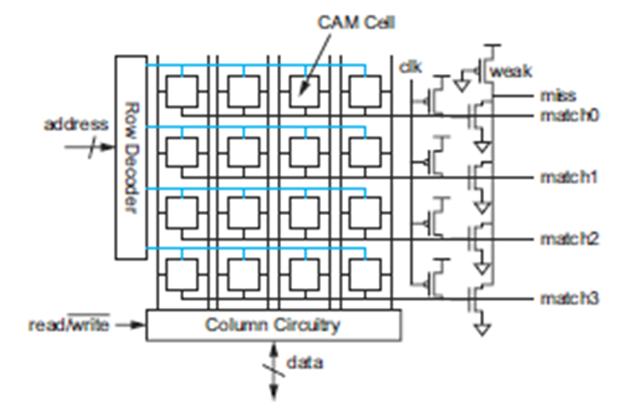

Random Read/Write similar to SRAM

**Matching operation**

- Pre-charge matchline to $V_{dd}$

- Broadcast query on bitlines across the array

- If a cell entry mismatches with a query, discharge matchline

- Most (even all) matchlines discharge for each query (dissipative)

- Matching lines are eitehr priority encoded or combined for a single match/miss result

- Segmented matching, NAND CMAs trade off speed for efficiency

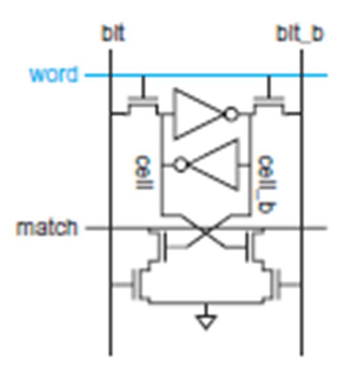

# Clock Domains

## Source of Clock Uncertainty

**Skew**: *Static Variation in arrival times across sink nodes*

- **Finite clock drive palette** (synthesis and apr (in space)) $\rightarrow$ design time skew

- **Process, $V_{dd}$, T (PVT)**

    - Variation/gradients across space in post-silicon

    - Worsened by: Low $V_{dd}$, low-slew (both things that allow energy efficient operation)

- **Affects setup and hold paths**

**Jitter**: *Dynamic variation in arrival times across sink nodes*

- **Noise in PLL**

- **$V_{dd}$ varivation again in *time***

- **Capacitive/Inductive coupling with signal/power lines**

- Different types

    - **Period Jitter**: period difference on 1 single cycle

    - **Cycle-to-cycle Jitter**: period difference on the two adjacent cycles

    - **Period jitter is more critial** 
    
        - Because **period jitter impact on setup paths**

        - Setup checks in 1 cycle later (from launch to capture)
    
    - But **Period jitter doesn't matter for hold-time analysis**

        - Because **hold checks on the same period**

        - Period jitter will shift both launch's and capture's edge, keep the same period difference, and lead no impact on hold

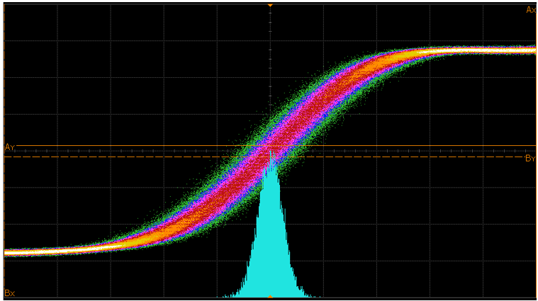

- The clock signal crosses at a certain voltage (e.g. 50% VDD) every cycle

- Because of the existence of jitter, these crossings will not be at exactly the same time point, but will have a distribution.

- Then forms the blue histogram

- The formula to calculate **Period Jitter**: 

    - $T_n = t_{n+1} - t_{n}$

    - $J_{period} = T_{n} - T_{avg}$

    - The usual output includes: RMS period jitter (standard variation $\delta$) and Peak-to-Peak period jitter (max-min)

- In this histogram, the blue bar is the **edge jitter** not the **period jitter**. To calculte the period jitter, you need to **use two adjacent edge jitters to calculate the time differences** and get period jitter from it.

### Example of Jitter calculation

Consider a pipeline stage with the following parameters:

- $T_{clk} = 250ps$

- $T_{skew} = 20ps$

- $T_{logic,min} = 10ps$

- $T_{logic,max} = 200ps$

- $T_{cq} = 35ps$

- $T_{setup} = 40ps$

- $T_{hold} = 20ps$

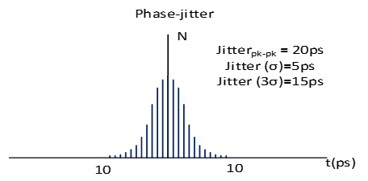

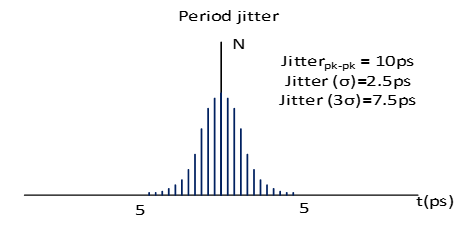

**Setup Slack**

Looks at the two adjacent period differences, so use **Period Jitter**

$$T_{clk} + T_{skew} - (T_{cq} + T_{logic,max} + T_{setup}) - T_{period jitter，3\delta}$$

$$= 250 + 20 - (35 + 200 + 40) - 7.5 = -12.5ps$$

**Hold Slack**

Looks at the single period, so use **Phase Jitter**

$$T_{cq} + T_{logic,min} - (T_{hold} + T_{skew}) - T_{phase jitter, 3\delta}$$

$$= 35 + 10 - (20 + 20) - 15 = -10ps$$

### Example of Skew calculation

Divide timing-uncertainty into two parts: **shared and unshared**

- Shared component is common and can be omitted

- Unshared component forms the relevant timing uncertainty for a path

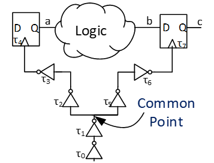

$$T_{skew} = T_{capture} - T_{launch}$$

$$= (\tau_5 + \tau_6 + \tau_7) - (\tau_2 + \tau_3 + \tau_4)$$

**Skew (clock phase difference) has opposite effect on setup and hold**

- Setup requirement

$$T_{cq} + T_{logic,max} + T_{setup} + T_{period jitter}^{a \rightarrow b} < T_{clk} + T_{skew}$$

- Hold requirement

$$T_{cq} + T_{logic,min} > T_{hold} + T_{skew} + T_{phase jitter}^{a,b}$$

**Uncertainty hurts both (setup and hold) equally**

- $\delta_{\tau,eff} \approx k \sqrt{N + M} \delta_{\tau0}$

**Different mechanisms of jitter at play for setup and hold**

- $T_{phase jitter}^{a,b}$ is **not the same as phase jitter on a or b**

- but the non-shared jitter remaining after their difference

- The jitter path also needs to be differentiated: the shared part is offset and the unshared part is retained.

## Clock-domain crossing

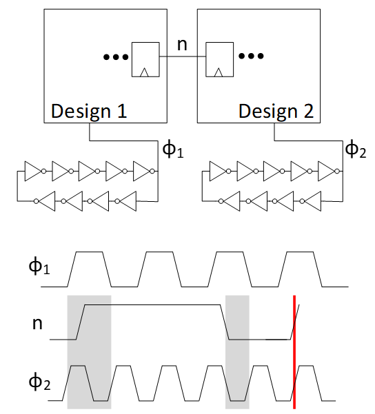

- Independent ring oscillator **different frequences**

- **Data flows** from Design1 to Design2

- Cannot guanrantee *setup and hold compilance*

    - **Phase relationship not controlled**

    - **Phase varies over time**

Setup and hold typically defined by "push-out" and "glitch" metrics

- $T_{CQ}$ keeps increasing

- The delay could be **unbounded**

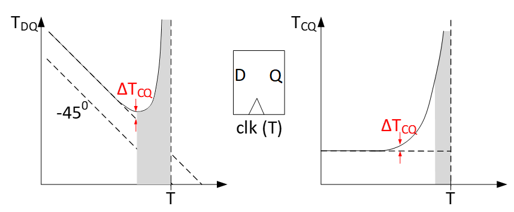

If data is latched in the middle of its transition?

- Q could lead to glitch

- could lead uncertainty (metastability)

- the later logic will be destoried as well

### Metastability: A case of unstable equilibrium

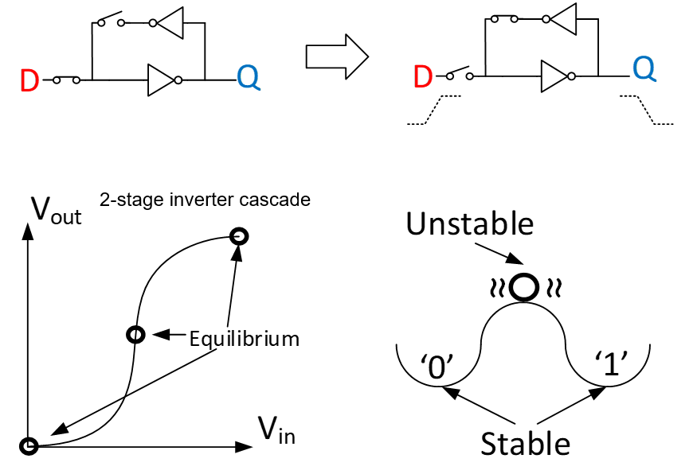

### Another perspective of metastability: Back-to-Back Positive Feedback Amplifiers

Differential voltage determines differences in current drive, **regardless of common-mode voltage**

- i.e., The metastability recovery speed of Flip-Flop is only determined by the differential voltage and has nothing to do with the common-mode voltage.

The latch can be approximated as one:

- A capacitor + a controlled source with gain G $\rightarrow$ a first-order differential amplifier

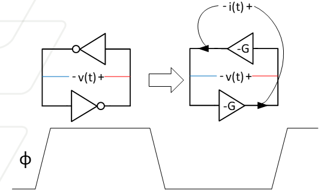

$$C\frac{dv}{dt} = i = Gv$$

$$\Rightarrow \int_{V(0)}^{V}\frac{1}{v}dv = \frac{G}{C}\int_{0}^{\tau}dt$$

$$\Rightarrow \ln v |_{V(0)}^{V} = \frac{G}{C} t|_{0}^{\tau}$$

$$\ln V - \ln V(0) = \frac{G}{C} (\tau - 0)$$

$$\ln \frac{V}{V(0)} = \frac{G}{C}\tau$$

$$\Rightarrow \frac{V}{V(0)} = e^{\frac{G}{C}\tau}$$

$$V = V(0)e^{\frac{G}{C}\tau}$$

Let $\Tau = \frac{C}{G}$

$$V = V(0)e^{\frac{\tau}{\Tau}}$$

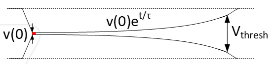

To ensure $V > V_{threshold}$ at $t = t'$ then:

$$V(0)e^{\frac{\tau}{\Tau}} > V_{threshold}$$

$$\Rightarrow V(0) > V_{threshold}e^{-\frac{\tau}{\Tau}}$$

The smaller the initial differential voltage V(0), the easier it is for Flip-Flop to get stuck in the metastable state; it takes more time t' to recover.

### Quantifying the impact of metastability

V(0) "aperture" translates to an aperture time $t_a$, where data capture leads to metastability

Assuming uniformly distributed data arrival, **probability of a metastable failure**:

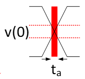

$$P(mf) = \frac{t_a}{T_{cyc}} = T_0e^{-\frac{t_{resolve}}{\tau}}f$$

- $T_0$: related to trigger structure, VDD, circuit gain

- $\tau$: metastability time constance, the previous $\Tau (\frac{C}{G})$

    - The larger $\tau$, the slower the recovery $\rightarrow$ metastability occurs more often

- $t_{resolve}$: the recovery time for flip-flop

    - usually, $t_{resolve} = T_{clk} - T_{setup}$

    - $T_{setup}$ here is the previous stage's time consumption

    - The larger $T_{setup} \Rightarrow$ the less time time is left for metastability $\Rightarrow$ the larger the failure rate

    - The smaller $t_{resolve}$ is, easier metastability failure will be

- $f$: clock flip frequency (i.e, sampling frequency)

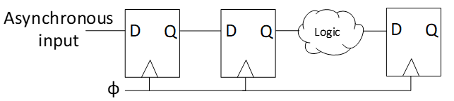

$$failure \text{\_} rate = f_DfT_0e^{-\frac{T_{clk} - T_{setup}}{\tau}}$$

The **Mean time between failure (MBTF)** will be

$$MTBF = \frac{1}{failure \text{\_} rate} = \frac{e^{\frac{T_{clk} - T_{setup}}{\tau}}}{f_DfT_0}$$

- The larger $\frac{T_{clk} - T_{setup}}{\tau}$ is, the MTBF will improve a lot

- Insert more time margin between two synchronizer FF, MTBF will increase **expoentially** instead of linearly

### Example of quantifying metastability

Consider a flip-flop with $T_0 = 50p, \tau = 100p, T_{setup} = 100p$ utilized in a receiver flip-flop operating at 1GHz ($T_{clk,u} = 300p$). The arrangement of the flops is shown in the figure. Source data arrives randomly, in a uniformly distributed fashion at the flip-flop at an average rate of 400MHz. What is the Mean Time Between Failures?

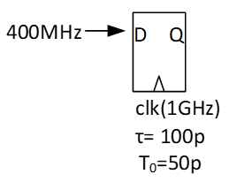

$$P(mf) = fT_0e^{-\frac{T_{resolve}}{\tau}}$$

$$=10^9 \times 50 \times 10^{-12} \times e^{-\frac{1n - 300p - 100p}{100p}}$$

$$= 1.2 \times 10^{-4}$$

$$failure \text{\_} rate (\text{per second}) = f_D \times P(mf)$$

$$= 1.2 \times 10^{-4} \times 400 \times 10^{6}$$

$$= 48000$$

$$MTBF = \frac{1}{failure \text{\_} rate (\text{per second})} = 20.8 \mu s$$

### Taxonomy of Clock Domain Crossings (CDC)

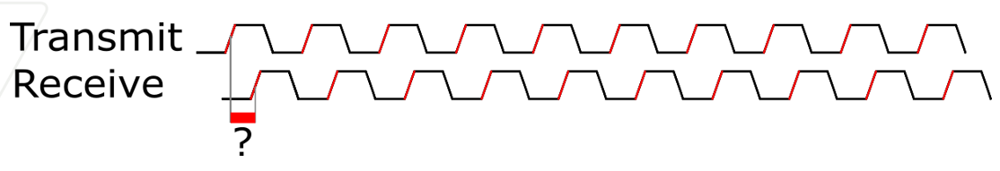

**Mesochronous**: Frequency locked but arbitrary (**but constant**) phase raltionship

- The frequency is the same (locked very accurately)

- But the phase is an arbitrary, fixed constant offset

- The phase difference causes the data to appear in a dangerous position in the receiving field $\Rightarrow$ setup/hold margin is very small $\Rightarrow$ metastability risk is high

- Need to use Synchronizer

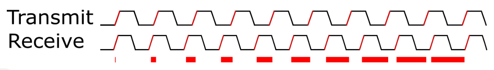

**Plesiochronous**: Frequencies **almost** identical (typical across systems that are locked to REFCLK from different crystal oscillators (Therefore, different $f_{clk}$ down to ppm))

- Frequencies are almost identical (ppm level difference)

- But not completely locked to the same clock source

- Data "slowly drifts" relative to the receive clock

- **Need to use asynchronous FIFO or rate matching** technique instead of simple synchronizer

**Asynchronous**: No phase or frequency relationship (**BUT, rates must be balanced**)

- The two clocks have no correlation, no fixed frequency ratio, and no phase relationship.

- Totally unpredictable, the most typical and dangerous CDC

- If both sides use FIFO to exchange data, in order to **avoid overflow / underflow**: Data rates must be **balanced over the long term (average rate matching)**

### CDC safely: 2 FF synchronizers with hand-shaking

**Key Observation**: A single stable transition can cross domains without corruption.

- not per-cycle switching signals

- You still have to avoid metastability (fundamental)

You cannot transmit high-speed data signals across domains, but **you can safely transmit an asynchronous event**.

**Don't directly transmit data across domains, but transmit "a stable event signal (Req/Ack)" across domains**, **allowing the target clock domain to sample stable data at the correct time**

**4-phase level based Handshake (return-to-zero)**

(1) System A has generated DataA and sends an asynchronous ReqA = 1 (valid in AXI bus) to System B

- Ensure DataA has been stable in domain A

- Tell system B data is prepared well

- ReqA is clock-domain-crossing event, and could be metastable

- System B uses 2 stage DFF synchronizer to receive this aysnchronous input signal

- The synchronized signal of asynchronous ReqA is ReqB

(2) System B sees the synchronous ReqB = 1 at its clocking domain

- Sample DataA, which has been synchronized by 2 stage DFF synchronizers as well

- Send the asynchronous AckB (ready in the AXI) to system A

(3) System A uses 2 stage DFF synchronizer to synchronize AckB and get the synchronized AckA at its clocking domain

- deassert the asynchronous signal ReqA

(4) System B sees the deasserted synchronous Req (ReqA synchronized by 2 stage DFF synchronizer) at its clocking domain

- deassert the asynchronous signal AckB

```verilog
module transmitter #(
    parameter DATA_WIDTH = 8
) (
    input  logic                    clk_i,
    input  logic                    rstn_i,
    input  logic                    en_i,
    input  logic [DATA_WIDTH-1:0]   data_i,
    input  logic                    ack_i,
    output logic                    req_o,
    output logic [DATA_WIDTH-1:0]   data_o
);
    logic sync_ack_r1, sync_ack_r2;

    // Input asynchronous signal ack synchronizer
    always_ff @(posedge clk_i or negedge rstn_i)
        if (!rstn_i)
            {sync_ack_r1, sync_ack_r2} <= 2'b00;
        else
            {sync_ack_r1, sync_ack_r2} <= {ack_i, sync_ack_r1};

    // Load data
    always_ff @(posedge clk_i or negedge rstn_i)
        if (!rstn_i)
            data_o <= '0;
        // don't load when handshaking
        else if (en_i && !req_o && !sync_ack_r2)
            data_o <= data_i;

    // Control output signal req
    always_ff @(posedge clk_i or negedge rstn_i)
        if (!rstn_i)
            req_o <= 1'b0;
        else if (en_i && !sync_ack_r2)
            req_o <= 1'b1;
        else if (sync_ack_r2)
            req_o <= 1'b0;

endmodule

module receiver #(
    parameter DATA_WIDTH = 8
) (
    input  logic                    clk_i,
    input  logic                    rstn_i,
    input  logic                    req_i,
    input  logic [DATA_WIDTH-1:0]   data_i,
    output logic                    ack_o,
    output logic [DATA_WIDTH-1:0]   data_o,
    output logic                    valid_o
);
    logic sync_req_r1, sync_req_r2;

    // Input asynchronous signal req synchronizer
    always_ff @(posedge clk_i or negedge rstn_i)
        if (!rstn_i)
            {sync_req_r1, sync_req_r2} <= 2'b00;
        else
            {sync_req_r1, sync_req_r2} <= {req_i, sync_req_r1};
    
    // Load data
    always_ff @(posedge clk_i or negedge rstn_i)
        if (!rstn_i) begin
            data_o <= '0;
            valid_o <= 1'b0;
        end
        else if (sync_req_r2) begin
            data_o <= data_i;
            valid_o <= 1'b1;
        end 
        else
            valid_o <= 1'b0;

    // Control output signal ack
    always_ff @(posedge clk_i or negedge rstn_i)
        if (!rstn_i)
            ack_o <= 1'b0;
        else
            ack_o <= sync_req_r2 ? 1'b1 : 1'b0;

endmodule
```

**2-phase toggle based Handshake**

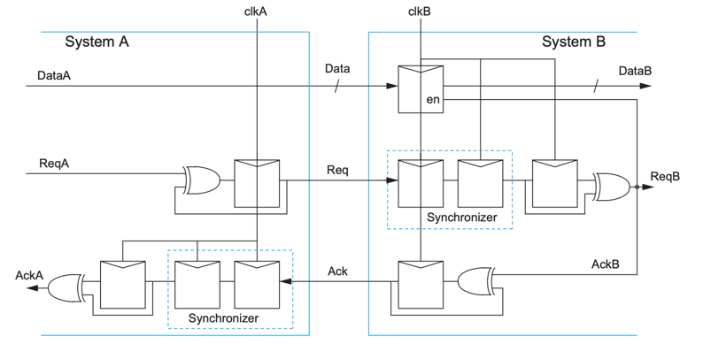


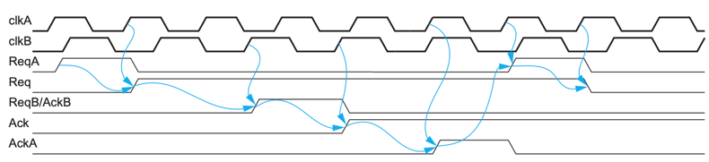

(1) Transmitter toggles Req and receiver receives the synchronized toggled req signal

- receiver detects the toggle (edge) of req and sample the data

- receiver toggles Ack

(2) Trasmitter receives the synchronized ack

- tranmitter knows this transcation done

```verilog
module transmitter #(
    parameter DATA_WIDTH = 8
) (
    input  logic                    clk_i,
    input  logic                    rstn_i,
    input  logic                    valid_i,
    input  logic [DATA_WIDTH-1:0]   data_i,
    input  logic                    ack_i,
    output logic                    req_o,
    output logic [DATA_WIDTH-1:0]   data_o,
    output logic                    ready_o
);
    typedef enum logic {IDLE = 1'b0, BUSY = 1'b1} state_en_t;
    state_en_t state_r, next_state_r;
    logic sync_ack_r1, sync_ack_r2, ack_tog_w;

    // Input asynchronous signal ack synchronizer
    always_ff @(posedge clk_i or negedge rstn_i)
        if (!rstn_i)
            {sync_ack_r1, sync_ack_r2} <= 2'b00;
        else
            {sync_ack_r1, sync_ack_r2} <= {ack_i, sync_ack_r1};

    // Detect ack edge
    assign ack_tog_w = sync_ack_r1 ^ sync_ack_r2;

    // Finite state machine updating
    always_ff @(posedge clk_i or negedge rstn_i)
        if (!rstn_i) state_r <= IDLE;
        else         state_r <= next_state_r;

    // Finite State Machine
    always_comb begin
        case (state_r)
            IDLE:    next_state_r = valid_i   ? BUSY : IDLE;
            BUSY:    next_state_r = ack_tog_w ? IDLE : BUSY;
            default: next_state_r = IDLE; 
        endcase
    end

    // Control output signals
    always_ff @(posedge clk_i or negedge rstn_i)
        if (!rstn_i) begin
            data_o <= '0; 
            req_o <= 1'b0; ready_o <= 1'b1;
        end
        else begin
            case (state_r)
                IDLE: begin
                    if (valid_i) begin
                        data_o  <= data_i;
                        req_o   <= ~req_o;
                        ready_o <= 1'b0;
                    end 
                end
                BUSY: if (ack_tog_w) ready_o <= 1'b1;
                default: begin 
                    data_o <= '0;
                    req_o <= 1'b0; ready_o <= 1'b1;
                end
            endcase
        end

endmodule

module receiver #(
    parameter DATA_WIDTH = 8
) (
    input  logic                    clk_i,
    input  logic                    rstn_i,
    input  logic                    req_i,
    input  logic [DATA_WIDTH-1:0]   data_i,
    output logic                    ack_o,
    output logic [DATA_WIDTH-1:0]   data_o,
    output logic                    valid_o
);
    typedef enum logic {IDLE = 1'b0, BUSY = 1'b1} state_en_t;
    state_en_t state_r, next_state_r;
    logic sync_req_r1, sync_req_r2, req_tog_w;

    // Input asynchronous signal req synchronizer
    always_ff @(posedge clk_i or negedge rstn_i)
        if (!rstn_i)
            {sync_req_r1, sync_req_r2} <= 2'b00;
        else
            {sync_req_r1, sync_req_r2} <= {req_i, sync_req_r1};

    // Detect req edge
    assign req_tog_w = sync_req_r1 ^ sync_req_r2;

    // Finite state machine updating
    always_ff @(posedge clk_i or negedge rstn_i)
        if (!rstn_i) state_r <= IDLE;
        else         state_r <= next_state_r;

    // Finite State Machine
    always_comb begin
        case (state_r)
            IDLE: next_state_r = req_tog_w ? BUSY : IDLE;
            BUSY: next_state_r = IDLE;
            default: next_state_r = IDLE;
        endcase
    end

    // Control output signals
    always_ff @(posedge clk_i or negedge rstn_i)
        if (!rstn_i)
            {data_o, ack_o, valid_o} <= '0;
        else
            case (state_r)
                IDLE: begin
                    if (req_tog_w) begin
                        data_o  <= data_i;
                        ack_o   <= ~ack_o;
                        valid_o <= 1'b1;
                    end
                end
                // valid only for 1 cycle
                BUSY: valid_o <= 1'b0;
                default: {data_o, ack_o, valid_o} <= '0;
            endcase
            
endmodule
```

### CDC safely: Asynchronous FIFOs

When multiple cycles pre transaction?

We uses asynchronous FIFOs

- when one transaction is not completed in one cycle

- or transmitter has different clock period with receiver

- or need high data throughout

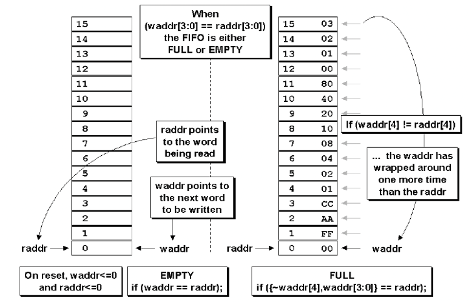

Send data across asynchronous clock domains

Why not just do a handshake for each data transfer?

- Because one data transmission needs 2 (2 phase toggle based handshake) cyles or 4 (4 phase level based handshake) cycles

- Low data throughout

- The logic could be a little complex and may lead to CDC error

Here are some advantages of FIFOs：

- The transmitter only takes care of **writing**

- The receiver only takes care of **reading**

- FIFO could deal with different writing and reading ratio

- It can also support **burst/pipeline/multiple-cycles** transaction

Key in the Design of asynchronous FIFO is: **1 wrap bit more than data width** to indicate wrapping, so that can check whether FIFO is empty or full

- You cannot use counter

- waddr - raddr is invalid

- You can only compare

    - Gray code

    - two pointers are same or not

    - wrap bit is flipped or not

**Empty and Full Conditions**

Detecting wptr == rptr events **across clock domains**

- Wptr must migrate to read domain, and vice versa to allow read-stall and write-stall

Does communication latency risk overwrite/overread conditions?

- We know CDC synchronizer needs 2 FF to synchronize.

- There would be 1-2 cycle latency

- If write too fast, could it overwrite?

- If read too fast, could it read empty?

The answer is No. 

- Because using **Gray code**

    - Only 1 bit flip when synchronizing

- FULL/EMPTY is 

    - **Conservative judgement**

    - We would rather delay the process than mistakenly allow someone through

- **The 1-2 cycle latency only affect/reduce data throughout without sabotaging correctness**

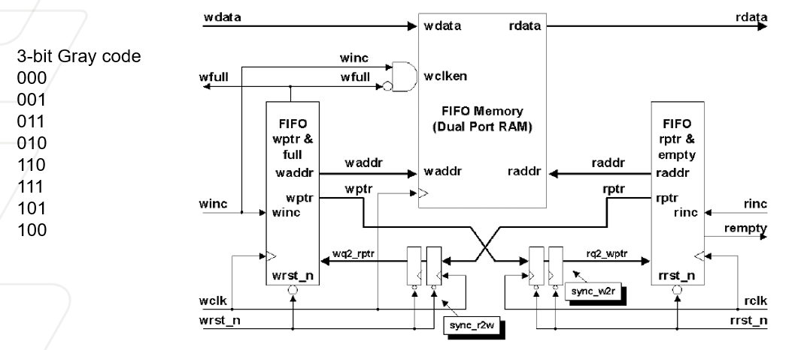

Each domain:

- Index memory using binary code

- Communicate address cross-domain using Gray, then compare Gray codes on the other side.

```verilog
// It's actually derived from a circular FIFO
// The four main technique to solve CDC (Clock Domain Crossing) Problem
// 1. Handshake Protocol (used in previous example)
// 2. FIFO buffer (the core of asynchronous FIFO)
// 3. Synchronizer (used in both) 
// 4. Gray code (used in this example)

module async_fifo #(
    parameter int DATA_WIDTH = 8,
    parameter int FIFO_DEPTH = 16
) (
    input  logic                    rstn_i,
    input  logic                    wr_clk_i,
    input  logic                    rd_clk_i,

    // Write Ports
    input  logic                    wr_en_i,
    input  logic [DATA_WIDTH-1:0]   wr_data_i,
    output logic                    full_o,

    // Read Ports
    input  logic                    rd_en_i,
    output logic [DATA_WIDTH-1:0]   rd_data_o,
    output logic                    empty_o
);
    // Local parameter
    localparam int PTR_WIDTH = $clog2(FIFO_DEPTH) + 1;
    // FIFO Memory
    logic [DATA_WIDTH-1:0] mem[0:FIFO_DEPTH-1];

    // Write side pointers
    logic [PTR_WIDTH-1:0] wr_ptr_bin, wr_ptr_gray;
    logic [PTR_WIDTH-1:0] rd_ptr_gray_syn_to_wr_r1, rd_ptr_gray_syn_to_wr_r2, rd_ptr_bin_syn_to_wr;

    // Read side pointers
    logic [PTR_WIDTH-1:0] rd_ptr_bin, rd_ptr_gray;
    logic [PTR_WIDTH-1:0] wr_ptr_gray_syn_to_rd_r1, wr_ptr_gray_syn_to_rd_r2, wr_ptr_bin_syn_to_rd;

    // Binary -> Gray conversion
    function automatic [PTR_WIDTH-1:0] bin2gray([PTR_WIDTH-1:0] b);
        return b ^ (b >> 1);
    endfunction

    // Gray -> Binary conversion (not used)
    function automatic [PTR_WIDTH-1:0] gray2bin([PTR_WIDTH-1:0] g); 
        gray2bin[PTR_WIDTH-1] = g[PTR_WIDTH-1];
        for (int i = PTR_WIDTH-2; i >= 0; i--)
            gray2bin[i] = gray2bin[i+1] ^ g[i];
    endfunction

    // Binary -> Gray
    assign rd_ptr_gray = bin2gray(rd_ptr_bin);
    assign wr_ptr_gray = bin2gray(wr_ptr_bin);

    // Gray -> Binary
    assign rd_ptr_bin_syn_to_wr = gray2bin(rd_ptr_gray_syn_to_wr_r2);
    assign wr_ptr_bin_syn_to_rd = gray2bin(wr_ptr_gray_syn_to_rd_r2);

    // Synchronizers
    always_ff @(posedge wr_clk_i or negedge rstn_i)
        if (!rstn_i)
            {rd_ptr_gray_syn_to_wr_r1, rd_ptr_gray_syn_to_wr_r2} <= '0;
        else
            {rd_ptr_gray_syn_to_wr_r1, rd_ptr_gray_syn_to_wr_r2} <= {rd_ptr_gray, rd_ptr_gray_syn_to_wr_r1};
    
    always_ff @(posedge rd_clk_i or negedge rstn_i)
        if (!rstn_i)
            {wr_ptr_gray_syn_to_rd_r1, wr_ptr_gray_syn_to_rd_r2} <= '0;
        else
            {wr_ptr_gray_syn_to_rd_r1, wr_ptr_gray_syn_to_rd_r2} <= {wr_ptr_gray, wr_ptr_gray_syn_to_rd_r1};

    // Write domain
    always_ff @(posedge wr_clk_i or negedge rstn_i)
        if (!rstn_i)
            wr_ptr_bin <= '0;
        else if (wr_en_i && !full_o) begin
            mem[wr_ptr_bin[PTR_WIDTH-2:0]] <= wr_data_i;
            if (wr_ptr_bin[PTR_WIDTH-2:0] == FIFO_DEPTH - 1) begin
                wr_ptr_bin[PTR_WIDTH-1] <= ~wr_ptr_bin[PTR_WIDTH-1];
                wr_ptr_bin[PTR_WIDTH-2:0] <= '0;
            end
            else
                wr_ptr_bin <= wr_ptr_bin + 1'b1;    
        end

    // Read domain
    always_ff @(posedge rd_clk_i or negedge rstn_i)
        if (!rstn_i)
            rd_ptr_bin <= '0;
        else if (rd_en_i && !empty_o)
            if (rd_ptr_bin[PTR_WIDTH-2:0] == FIFO_DEPTH - 1) begin
                rd_ptr_bin[PTR_WIDTH-1] <= ~rd_ptr_bin[PTR_WIDTH-1];
                rd_ptr_bin[PTR_WIDTH-2:0] <= '0;
            end
            else
                rd_ptr_bin <= rd_ptr_bin + 1'b1;
    
    assign rd_data_o = mem[rd_ptr_bin[PTR_WIDTH-2:0]];

    // Empty detection (in read clock domain)
    assign empty_o = (rd_ptr_bin == wr_ptr_bin_syn_to_rd);

    // Full detection (in write clock domain)
    assign full_o = (wr_ptr_bin == {~rd_ptr_bin_syn_to_wr[PTR_WIDTH-1], rd_ptr_bin_syn_to_wr[PTR_WIDTH-2:0]});

    // Required assertions for this FIFO design
`ifdef SIM
    initial begin
        // FIFO_DEPTH must be greater than 1
        FIFO_DEPTH_greater_than_1_a: assert (FIFO_DEPTH > 1)
            else $fatal("FIFO_DEPTH (%0d) must be greater than 1", FIFO_DEPTH);
    end
`endif

endmodule
```

# DLLs

## A high-level Overiew

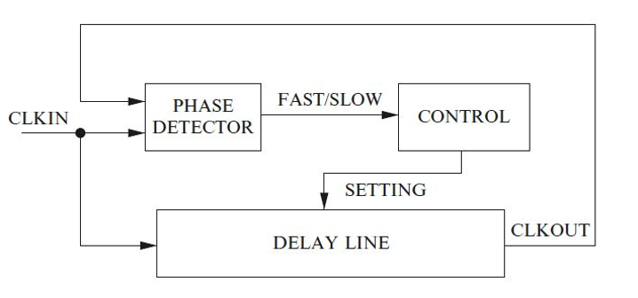

Goal: **Align CLKIN with CLKOUT**

- Detect **phase difference** between CLKIN and CLKOUT

- **Adjust path delay in CLKOUT** to align clock edges

Achieving **$\Delta \phi = 0$ is a special (and common) case**

- DLLs can **adjust clock edge to occur at any "event"** ($90 \degree, 180 \degree$, any phase position)

- It can used in DDR's DQS sampling, mult-phase clock

### Top-level perspective

- **Measure phase error (Lead/Lag)**

- **If leading, slow down (increase delay-line delay)**

- **If lagging, speed up (decrease delay-line delay)**

- **At lock, dithering between the Lead/Lag state**

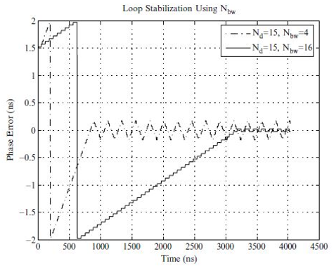

- $N_{bw}$ is the controlling parameter

- Larger $N_{bw}$ has faster controlling response but larger stable jitter

- Smaller $N_{bw}$ has smaller stable jitter but smaller controlling response

## Digital Delay line

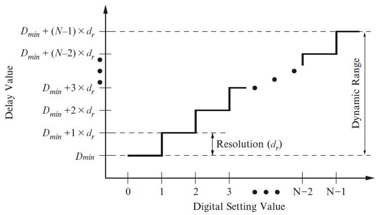

Key parameters depend on the context and application

- **Minimum Delay** ($D_{min}$)

    - When data code = 0, there is a non-zero delay

    - Could lead by buffer, mux, routing

- **Resolution** ($d_r$)

    - $D(k) = D_{min} + k \times d_r$

    - Smaller $d_r$ can make final stable jitter smaller, but cost larger area, complexity of controlling, and jitter possibility.

- **Dynamic Range**

    - $\text{Dynamic range} = (N - 1) \times d_r$

    - $N$ is the total number of delay the delay line can insert in

    - The dynamic range should usually $\geq 1$ clock period, otherwise it will fail to align phase (especially for **deskew**)

- **Linearity (Depends)**

    - DDL are not as extremely dependent on linearity as ADCs
    
    - As long as it's **monotonous and the loop can converge**, then it can eventually work.

### Examples for Delay Line

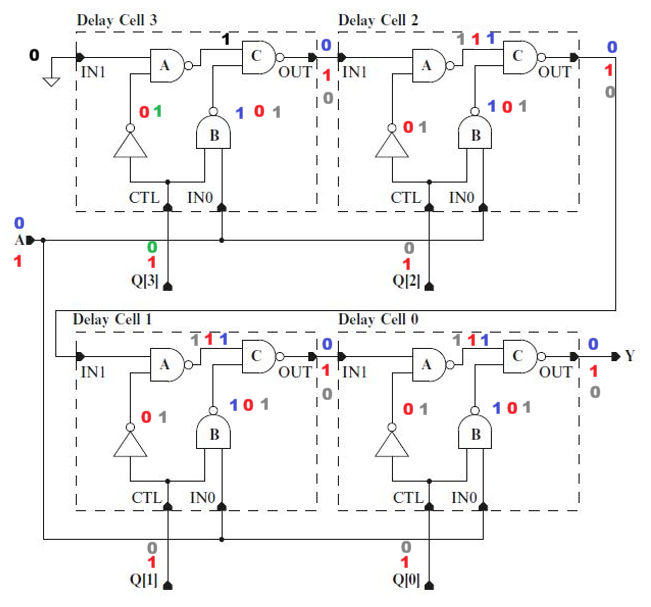

$$OUT = \overline{\overline{IN \cdot \overline{Q}} \cdot \overline{Q \cdot A}} = IN \cdot \overline{Q} + Q \cdot A$$

Here $IN3 = 0$

$$IN2 = OUT3 = Q3 \cdot A$$

$$IN1 = OUT2 = (Q3 \cdot A) \cdot \overline{Q2} + Q2 \cdot A = (Q3 \cdot \overline{Q2} + Q2) \cdot A$$

According to the formula $$X + YZ = (X + Y) (X + Z)$$, here $X = Q2, Y = Q3$ and $Z = \overline{Q2}, X + Z = 1$

$$IN1 = OUT2 = (Q3 + Q2) \cdot A$$

$$IN0 = OUT1 = ((Q3 + Q2) \cdot A) \cdot \overline{Q1} + Q1 \cdot A = ((Q3 + Q2) \cdot \overline{Q1} + Q1) \cdot A = (Q3 + Q2 + Q1) \cdot A$$

$$Y = OUT0 = (Q3 + Q2 + Q1 + Q0) \cdot A$$

The formula of final output Y dealy can be written as

$$\text{Total Delay} = \sum_{i=0}^{N}(Q[i] \times \Delta t) + \tau$$

, here $\Delta t$ is difference time between long path and short path of a delay cell.

- In one delay cell, the short path is approxmately `IN -> A AND -> C AND -> OUT`, the long path is nearly `IN -> A AND -> NOT -> B AND -> C AND -> OUT`.

- Long path has one more inverter (NOT) + AND gate, which is $\Delta t$

- $\tau$ is the overall shortest path, where Q[i] = 0

Why not a standard MUX?

- The Mux itself has high latency and high jitter

- This will disrupt the duty cycle

- There will be significant power supply noise coupling

- That's why we need to use **a gate-level symmetric structure** to implement "path selection"

### Telescoping Delay Line

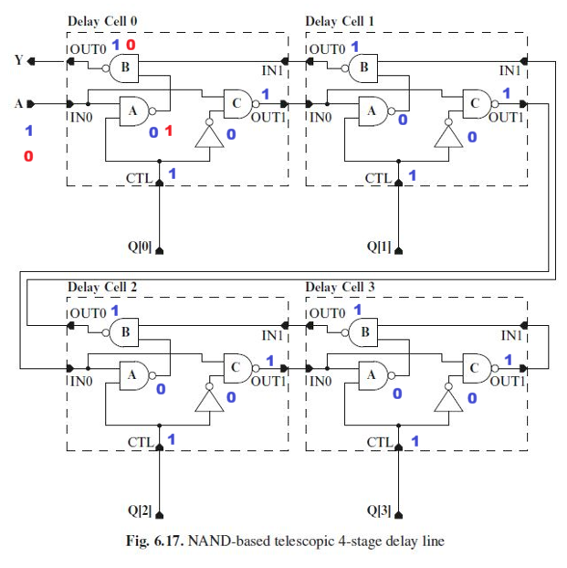

Designed for **high-speed and low jitter DLLs**

Logically, the delay is still 

$$\text{Total Delay} = \sum_{i=0}^{N}(Q[i] \times \Delta t) + \tau$$

But **electrically, not all cells are connected in series on a single load chain**.

- The **load for each cell is almost a constant**, so the **eventual delay will be linear and monotonic**. (The load of simple delay line is non-linear)

- The **jitter will be much smaller**. The casecaded noise amplification casued by the "pre-amplifier driving the power amplifier" configuration is eliminated. (**Supply noise will not accumulate over time**)

    - The jitter of the telescoping delay line $\propto$ single stage/cell jitter, instead of $N \times$ single stage/cell jitter

- More suitable for high-frequency, the time skews barely change.

There are some cons as well:

- complex placement and routing

- large area and not suitable for small/low-speed design

### More Delay Circuits

I want a *wide tuning range*, *high tuning resolution*, low jitter, and good locking performance. What should I do?

- Achieve large step delays using **series gate selection/multi-stage paths**

- Achieve samlle step delays and high-precision delays using **transistor-level adjustment**

In reality, DLL/Serdes/DDR implementations are always a combintaion of both (*coarse (gate/path level) and fine (transistor level)*)

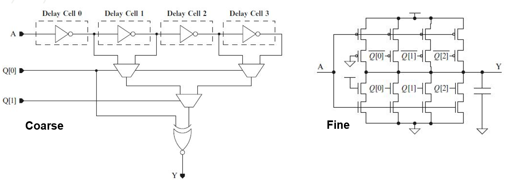

#### Coarse Delay Line

|   Q[1]    |   Q[0]    |   Toatl Dealy (Coarse) |
|-----------|-----------|------------------------|
|   0       |   0       |   $\Delta t$           |
|   0       |   1       |   $2\Delta t$          |
|   1       |   0       |   $3\Delta t$          |
|   1       |   1       |   $4\Delta t$          |

Solve the **latency range issue**

- The delay step is large (tens of ps to hundreds of ps)

- Low resolution

- Jitter is large (since it's gate/path level)

#### Fine Delay Line

Solve the **latency resolution issue**

- This is a transistor-level variable delay unit

- In the middle is a row of transistors controlled by Q[0] ~ Q[2]

    - **changable equivalent driving capability**

    - **changable equivalent capacitance/resistance**

- Adjust one gate a little faster/slower

- The delay step is smalle (1 ~ 5 ps)

- Monotonic, continuous, and calibratable

- Jittle is small

- Sensitive to PVT

### Metabstability and Glitching in DCDL

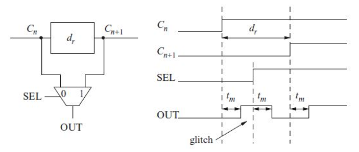

When one of these three conditions is met:

- The edges of $C_n$ and $C_{n+1}$ are very close together

- $SEL$ swicthes exactly between $C_n$ and $C_{n+1}$

- The $MUX$ sees $C_n$ and $C_{n+1}$ competing

Then out could be:

- Narrow pulse

- Brief transition

- Undetermined level (glitch)

**Metastability**

- A locked DLL is essentially trying to operate at its metastable point (try to make $CLKIN = CLKOUT$)

- The design must **tolerate and manage metastable states** rather than hoping they won't occur.

    - Can be solved with Early/Late Phase Detector (rather than simple sampling)

**Glitching**

- Almost never acceptable if you are working on clocking applications

- **Issue with coarse delay chains**

#### Dealing with Glitches

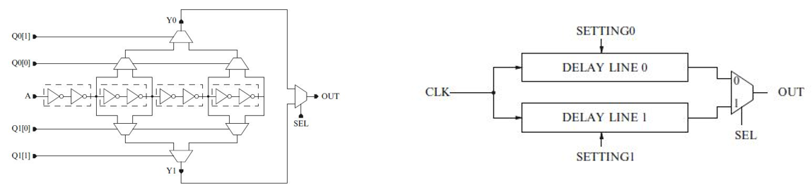

**Don't switch paths on a "running clock"**; instead, **prepare two (or more) complete and stable delay paths**, and then switch at a safe moment.

**Two sets of taps**

- Each has independent selection controls (Q[i])

- Each may experience internal glitches (that's okay)

- The key point is: **The SEL signal of this final MUX is switched in a slow, controlled, and glitch-free manner**.

- The glitch is confined within the tap selection and is not allowed to escape to the OUT port.

**Two delay paths**

- More safe and industry-level way

- Currently using Delay Line 0

    - Delay Line 1 is in the background

- DLL / Controller

    - Adjust SETTING1 on Delay Line 1

    - Any coarse/fine switch is allowed (nobody is using it)

- When Delay Line 1 is stable:

    - Switch SEL at a safe moment

    - Delay Line 0 moves to the background

- This is exactly the same as the CPU's double-buffer

## Different Applications of DLL

The core objective of a DLL can be summarized in one sentence:

- To adjust **a digital controllable delay line (DCDL)** so that the **feedback clock edge aligns with the reference clock edge**.

In constant, the core of PLL is **voltage controlled oscillator (VCO)** (analog way)

|              |      DLL     |       PLL        |
|--------------|--------------|------------------|
|Control Object|  Delay (time)|  Frequency/phase |
|Core Component|  DCDL        |  VCO             |
|Accumulated Phase Error| No  |  Yes             |
|Jitter        |  Smaller     |  Larger          |
|Multiple Freqeuncy| indirect (stitched along the edges) | direct|

### Zero-Delay Buffer

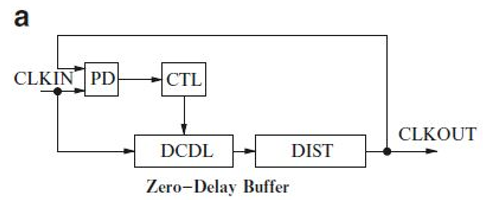

Most common and typical usage

Components

- **PD (Phase Detector)**: compare CLKIN vs CLKOUT

- **CTL (controller)**: convert edge difference into controlling code (analog to digital)

- **DCDL (Digital Control Delay Line)**: change delay according to the controlling code

- **DIST (Distribution)**: clock distribution network, used to simulate real clock tree

**Lock Situation**: **$(DCDL + DIST) \text{ mod } T_{clk} = 0$**

Physical Idea: 

- The clock tree inside the chip is very long.

- The DLL automatically compensates for this delay

- Making the CLKOUT signal seen inside the chip $\approx$ external CLKIN signal

DLLs don't eliminate latency; instead, they **cancel out the unknown latency using a reverse, adjustable delay**

### Matching Clock Distributions

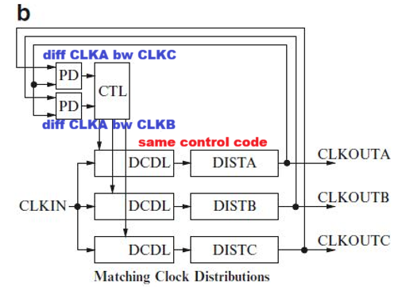

Generate multi-channel "delay-matched" clock outputs.

Components

- **Two PDs** (one is measuring CLKOUTA and CLKOUTB, another is measuring CLKOUTA and CLKOUTC)

- **One CTL** (all branches share one control code)

- **Three DCDL + Three DIST** (A/B/C)

Typical usage:

- DDR: CK / CK #

- Multiple PHY / multiple Lanes

- Synchronous ADC/DAC (multiple channels)

You don't care the absoluate difference between CLKIN and CLKOUT, but **the delay matching between A/B/C**

### 90-degree Phase Generation

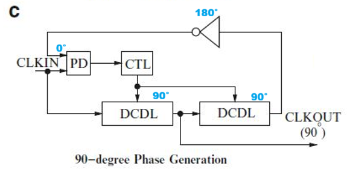

Generate a clock signal with a precise 90° phase shift

Component

- **One PD + One CTL**

- **One 2-tap DCDL (each T/4 delay)**

- **An inverter (equal to T/2 delay)**

Typical Usage

- DDR DQS (data gating signal)

- I/Q signal

- SerDes sampling

DLL are very goo at precise phase control; but not good at "long-term frequency drift" (which is precisely where PLLs excels)

### Clock Multiplication

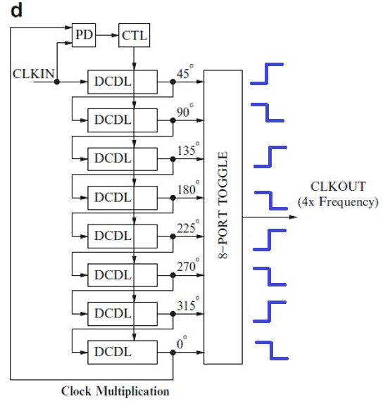

Advanced/Speical Application

Components

- **one PD + one CTL**

- **one 8-tap DCDL line + one 8-port toggle**

- **no DIST and achieve 4x Frequency**

**DLL doesn't generate a new frequency but precisely control the phase (generate even and accurate phase spaces)**

- Clock Multiplication is actually achieved by digital logic

The phase noise of a DLL frequency multiplier is usually better than that of a PLL

### Absolute Time Measurement

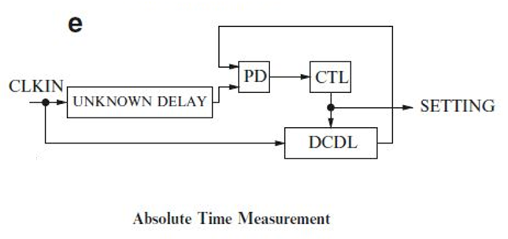

Using a DLL to measure an "unknown delay"

Components:

- **One PD + One CTL**

- **One DCDL and no DIST**

- **Output CTL's control code as setting**

- DLL works as a **Time-to-Digital Converter** (TDC)

**Lock Situation**: $DCDL = \text{Unknown Delay}$

Use CTL's control code to digitally represent unknown delay

Typical Usage:

- On-chip delay measurement

- PVT monitor

- Self-carlibrating I/O

- High accuracy time sensor

## Phase Detector

### A simple Phase Detector

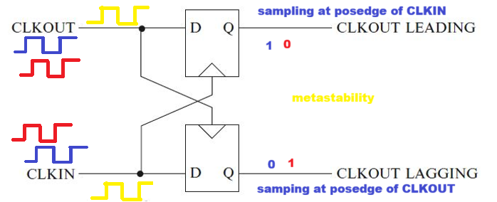

Output inidciate which block is leading, normally 1-hot (10 or 01)

When phase are almost same, then both DFF are in metastability.

- Possible for both to be 1

- Possible for both to be 0

The problems are

- No dead zone design

    - The output is unstable when the phases are close

    - It will keep shake and flip back and forth

- The probability of metastability is very high

### XOR based Phase Detector

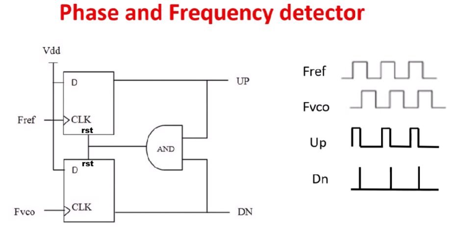

rstn is the problem

- asynchronously reset could lead to the glitch of Up or Down

### Hoggle Phase Detector (Early/Late Phase Detecor)

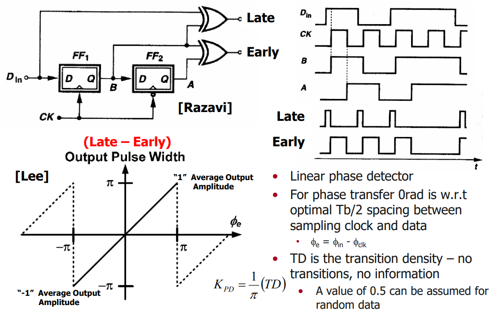

## Delay Lock Logic (Controller, CTL)

When $CLKOUT$ lags behind $CLKIN$, the control logic should cause the delay code to move monotonically in one direction until the two signals are aligned.

- But $CLKOUT = CLKIN + D_{min}$, where $D_{min}$ is the non-zero minimum delay.

- If the required delay is smaller than $D_{min}$, then DLL cannot align forever, in this case, **wrap-around** will happen

    - The delay could change from minimum delay to maximum delay
    
    - $CLKOUT$ will suddenly experienced a large jump.

    - DLL could be completely unlocked

DLL locking is a "digital control problem", not just an analog one

The delay should has upper and lower bound

- When reaching min/max, the output should **keep unchanged (saturate)**, instead of wrap

The trajectory should be monotonic, and predictable convergent.

- Cannot oscillate back and forth

- Cannot make large jumps

### FSM of DDL's controller

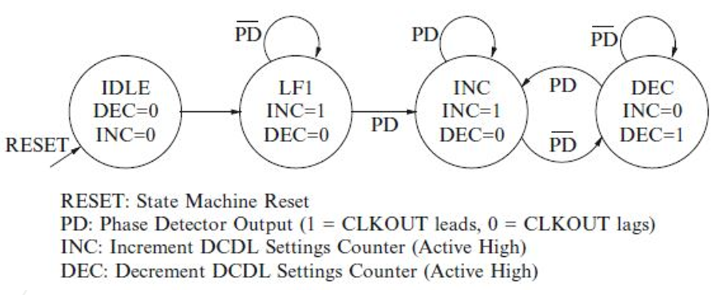

### A note on stability

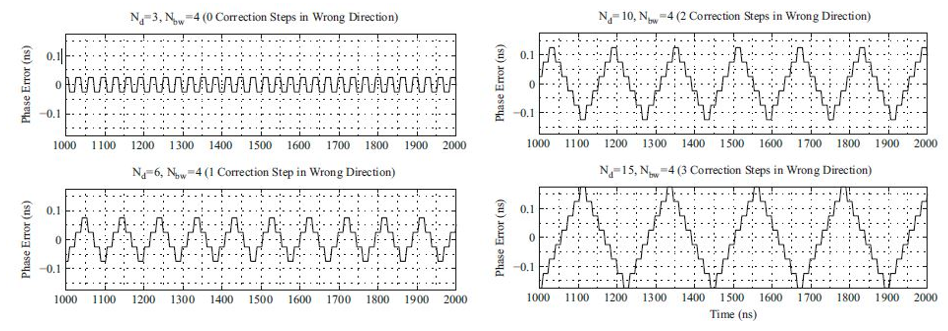

- $N$: Number of cycles of latency between phase detect and controller

    - From Phase Detector to Controller, there could be digital filter, to reduce noise

    - To avoid metastability

    - In reality DLL, N cannot be zero

- $D$: Number of cycles between code updates (FSM control code)

    - D = 1: The settings are being adjusted in every cycle (very aggressively).

    - D is large: Adjust slowly (very conservatively)

- Usually **D $\geq$ N**

    - After the system has seen the effect of the previous modification, then make the next modification

    - If delay codes are updated faster than the system can respond (D < N), the loop may apply corrections in the wrong direction, leading to oscillation.

    - Impacts Bandwidth

        - $T_{response} \approx N \cdot T_{clk} + D \cdot T_{clk}$

        - $\text{DLL bandwidth} \approx 1 / T_{response}$
